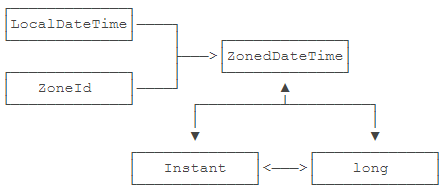

# yosoro~

日期与时间是计算机处理的中套数据。绝大部分程序的运行都要和时间打交道

## 基本概念

日期 Date 形如 `2021-12-11`

时间 Datetime 指时分秒，可以包含日期信息 `2021-12-11 23:59:29`

### 时区

一种是以`GMT`或者`UTC`加时区偏移表示，例如：`GMT+08:00`或者`UTC+08:00`表示东八区

另一种是缩写，例如，`CST`表示`China Standard Time`，也就是中国标准时间。但是`CST`也可以表示美国中部时间`Central Standard Time USA`，因此，缩写容易产生混淆，我们尽量不要使用缩写

最后一种是以洲／城市表示，例如，`Asia/Shanghai`，表示上海所在地的时区。特别注意城市名称不是任意的城市，而是由国际标准组织规定的城市

### 夏令时

所谓夏令时，就是夏天开始的时候，把时间往后拨1小时，夏天结束的时候，再把时间往前拨1小时。我们国家实行过一段时间夏令时，1992年就废除了，但是矫情的美国人到现在还在使用，所以时间换算更加复杂

计算夏令时请使用标准库提供的相关类，不要试图自己计算夏令时。

### 本地化

通常使用 `Locale` 表示一个国家或地区的日期、时间、数字、货币等格式，由 `语言_国家` 缩写构成，如 `zh_CN` 表示中文+中国，`en_US` 表示英文+美国，相应的时间表示也有所不同

| 中国用户 | 美国用户   |            |
| :------- | :--------- | ---------- |
| 购买价格 | 12000.00   | 12,000.00  |
| 购买日期 | 2016-11-30 | 11/30/2016 |

## Date 和 Calendar

`Epoch Time`是计算从1970年1月1日零点（格林威治时区／GMT+00:00）到现在所经历的秒数

在计算机中，只需要存储一个整数`1574208900`表示某一时刻。当需要显示为某一地区的当地时间时，我们就把它格式化为一个字符串：

```java
String displayDateTime(int n, String timezone) {...}
```

`Epoch Time`又称为时间戳，在不同的编程语言中，会有几种存储方式：

- 以秒为单位的整数：1574208900，缺点是精度只能到秒；
- 以毫秒为单位的整数：1574208900123，最后3位表示毫秒数；
- 以秒为单位的浮点数：1574208900.123，小数点后面表示零点几秒。

在Java程序中，时间戳通常是用`long`表示的毫秒数，即：

```java
long t = 1574208900123L;
```

可以使用`System.currentTimeMillis()`，这是Java程序获取时间戳最常用的方法。

### 标准库 API

Java标准库有两套处理日期和时间的API：

- 一套定义在`java.util`这个包里面，主要包括`Date`、`Calendar`和`TimeZone`这几个类；
- 一套新的API是在Java 8引入的，定义在`java.time`这个包里面，主要包括`LocalDateTime`、`ZonedDateTime`、`ZoneId`等。

#### Date

`java.util.Date`是用于表示一个日期和时间的对象，注意与`java.sql.Date`区分，后者用在数据库中

实际上存储了一个long类型的以毫秒表示的时间戳 `private transient long fastTime;`

```java
public class Main {
    public static void main(String[] args) {
        // 获取当前时间:
        Date date = new Date();
        System.out.println(date.getYear() + 1900); // 必须加上1900
        System.out.println(date.getMonth() + 1); // 0~11，必须加上1
        System.out.println(date.getDate()); // 1~31，不能加1
        // 转换为String:
        System.out.println(date.toString());
        // 转换为GMT时区:
        System.out.println(date.toGMTString());
        // 转换为本地时区:
        System.out.println(date.toLocaleString());
    }
}
```

注意`getYear()`返回的年份必须加上`1900`，`getMonth()`返回的月份是`0`~`11`分别表示1~12月，所以要加1，而`getDate()`返回的日期范围是`1`~`31`，又不能加1

想要针对用户的偏好精确地控制日期和时间的格式，就可以使用`SimpleDateFormat`对一个`Date`进行转换。它用预定义的字符串表示格式化：可以从 [JDK文档](https://docs.oracle.com/en/java/javase/12/docs/api/java.base/java/text/SimpleDateFormat.html) 乍看详细的格式说明（不能转时区，不能做差）

- yyyy：年
- MM：月
- dd: 日
- HH: 小时
- mm: 分钟
- ss: 秒

```java
Date date = new Date();
var sdf = new SimpleDateFormat("yyyy-MM-dd HH:mm:ss");
sdf.format(date);
```

#### Calendar

可用于获取并设置年、月、日、时、分、秒，它和`Date`比，主要多了一个可以做简单的日期和时间运算的功能，以及时区转换功能

```java
public class Main {
    public static void main(String[] args) {
        // 获取当前时间: 只能通过这种方法获取实例
        Calendar c = Calendar.getInstance();
        int y = c.get(Calendar.YEAR);
        int m = 1 + c.get(Calendar.MONTH);
        int d = c.get(Calendar.DAY_OF_MONTH);
        int w = c.get(Calendar.DAY_OF_WEEK);
        int hh = c.get(Calendar.HOUR_OF_DAY);
        int mm = c.get(Calendar.MINUTE);
        int ss = c.get(Calendar.SECOND);
        int ms = c.get(Calendar.MILLISECOND);
        c.set(Calendar.Second, 23); // 可以逐个重设所有 field
        Date to_date = c.getTime(); // 转为 Date 对象
        System.out.println(y + "-" + m + "-" + d + " " + w + " " + hh + ":" + mm + ":" + ss + "." + ms);
    }
}
```

#### TimeZone

其对象用于表示时区，时区的唯一标识是以字符串表示的ID，我们获取指定`TimeZone`对象也是以这个ID为参数获取，`GMT+09:00`、`Asia/Shanghai`都是有效的时区ID。要列出系统支持的所有ID，请使用`TimeZone.getAvailableIDs()`

```java
public class Main {
    public static void main(String[] args) {
        // 当前时间:
        Calendar c = Calendar.getInstance();
        // 清除所有:
        c.clear();
        // 设置为北京时区:
        c.setTimeZone(TimeZone.getTimeZone("Asia/Shanghai"));
        // 设置年月日时分秒:
        c.set(2019, 10 /* 11月 */, 20, 8, 15, 0);
        // 加5天并减去2小时:
        c.add(Calendar.DAY_OF_MONTH, 5);
        c.add(Calendar.HOUR_OF_DAY, -2);
        // 显示时间:
        var sdf = new SimpleDateFormat("yyyy-MM-dd HH:mm:ss");
        sdf.setTimeZone(TimeZone.getTimeZone("America/New_York"));
        System.out.println(sdf.format(c.getTime()));
        // 2019-11-19 19:15:00
    }
}
```

利用`Calendar`进行时区转换的步骤是：

1. 清除所有字段；
2. 设定指定时区；
3. 设定日期和时间；
4. 创建`SimpleDateFormat`并设定目标时区；
5. 格式化获取的`Date`对象（注意`Date`对象无时区信息，时区信息存储在`SimpleDateFormat`中）

本质上时区转换只能通过 `SimpleDateFormat` 在显示的时候完成

## LocalDateTime

从 Java8 开始，`java.time` 包提供了新的日期和时间 API，主要涉及的类型有：

- 本地日期和时间：`LocalDateTime`，`LocalDate`，`LocalTime`；
- 带时区的日期和时间：`ZonedDateTime`；
- 时刻：`Instant`；
- 时区：`ZoneId`，`ZoneOffset`；
- 时间间隔：`Duration`

以及一套新的用于取代`SimpleDateFormat`的格式化类型`DateTimeFormatter`

新API修正了旧API不合理的常量设计：

- Month的范围用1~12表示1月到12月；
- Week的范围用1~7表示周一到周日

最后，新API的类型几乎全部是不变类型（和String类似），可以放心使用不必担心被修改

#### LocalDateTime

```java
public class Main {
    public static void main(String[] args) {
        LocalDate d = LocalDate.now(); // 当前日期
        LocalTime t = LocalTime.now(); // 当前时间 
        LocalDateTime dt = LocalDateTime.now(); // 当前日期和时间
      // LocalDate sd = dt.toLocalDate();
      // LocalTime st = dt.toLocalTime();
        System.out.println(d); // 严格按照ISO 8601格式打印
        System.out.println(t); // 严格按照ISO 8601格式打印
        System.out.println(dt); // 严格按照ISO 8601格式打印
        // 指定日期和时间:
        LocalDate d2 = LocalDate.of(2019, 11, 30); // 2019-11-30, 注意11=11月
        LocalTime t2 = LocalTime.of(15, 16, 17); // 15:16:17
        LocalDateTime dt2 = LocalDateTime.of(2019, 11, 30, 15, 16, 17);
        LocalDateTime dt3 = LocalDateTime.of(d2, t2);
    }
    public void parseStr() {
        LocalDateTime dt = LocalDateTime.parse("2019-11-19T15:16:17");
        LocalDate d = LocalDate.parse("2019-11-19");
        LocalTime t = LocalTime.parse("15:16:17");
    }
}
```

本地日期和时间通过now()获取到的总是以当前默认时区返回的，和旧API不同，`LocalDateTime`、`LocalDate`和`LocalTime`默认严格按照[ISO 8601](https://www.iso.org/iso-8601-date-and-time-format.html)规定的日期和时间格式进行打印。

通过指定的日期和时间创建`LocalDateTime`可以通过`of()`方法

同时将字符串转换为`LocalDateTime`就可以传入标准格式

注意ISO 8601规定的日期和时间分隔符是`T`。标准格式如下：

- 日期：yyyy-MM-dd
- 时间：HH:mm:ss
- 带毫秒的时间：HH:mm:ss.SSS
- 日期和时间：yyyy-MM-dd'T'HH:mm:ss
- 带毫秒的日期和时间：yyyy-MM-dd'T'HH:mm:ss.SSS

#### DateTimeFormatter

如果要自定义输出的格式，或者要把一个非ISO 8601格式的字符串解析成`LocalDateTime`，可以使用新的`DateTimeFormatter`

```java
public class Main {
    public static void main(String[] args) {
        // 自定义格式化:
        DateTimeFormatter dtf = DateTimeFormatter.ofPattern("yyyy/MM/dd HH:mm:ss");
        System.out.println(dtf.format(LocalDateTime.now()));
        // 用自定义格式解析:
        LocalDateTime dt1 = LocalDateTime.parse("2019/11/30 15:16:17", dtf);
        System.out.println(dt2);
        // 加5天减3小时:
        LocalDateTime dt2 = dt.plusDays(5).minusHours(3);
        System.out.println(dt2); // 2019-10-31T17:30:59
        // 减1月:
        LocalDateTime dt3 = dt2.minusMonths(1);
        System.out.println(dt3); // 2019-09-30T17:30:59
    }
}
```

如上可以直接链式进行加减

对日期和时间进行调整则使用`withXxx()`方法，例如：`withHour(15)`会把`10:11:12`变为`15:11:12`：

- 调整年：withYear()
- 调整月：withMonth()
- 调整日：withDayOfMonth()
- 调整时：withHour()
- 调整分：withMinute()
- 调整秒：withSecond()

要判断两个`LocalDateTime`的先后，可以使用`isBefore()`、`isAfter()`方法传入另一个对象，对于`LocalDate`和`LocalTime`类似

#### Duration 和 Period

`Duration`表示两个时刻之间的时间间隔。另一个类似的`Period`表示两个日期之间的天数：

```java
public class Main {
    public static void main(String[] args) {
        LocalDateTime start = LocalDateTime.of(2019, 11, 19, 8, 15, 0);
        LocalDateTime end = LocalDateTime.of(2020, 1, 9, 19, 25, 30);
        Duration d = Duration.between(start, end);
        System.out.println(d); // PT1235H10M30S

        Period p = LocalDate.of(2019, 11, 19).until(LocalDate.of(2020, 1, 9));
        System.out.println(p); // P1M21D
    }
}
```

两个`LocalDateTime`之间的差值使用`Duration`表示，类似`PT1235H10M30S`，表示1235小时10分钟30秒。而两个`LocalDate`之间的差值用`Period`表示，类似`P1M21D`，表示1个月21天。

`Duration`和`Period`的表示方法也符合ISO 8601的格式，它以`P...T...`的形式表示，`P...T`之间表示日期间隔，`T`后面表示时间间隔。如果是`PT...`的格式表示仅有时间间隔。利用`ofXxx()`或者`parse()`方法也可以直接创建`Duration`：

```java
Duration d1 = Duration.ofHours(10); // 10 hours
Duration d2 = Duration.parse("P1DT2H3M"); // 1 day, 2 hours, 3 minutes
```

## ZonedDateTime

带时区的日期和时间。可以简单地把`ZonedDateTime`理解成`LocalDateTime`加`ZoneId`。`ZoneId`是`java.time`引入的新的时区类，注意和旧的`java.util.TimeZone`区别

```java
public class Main {
    public static void main(String[] args) {
        // 调用 now() 方法
        ZonedDateTime zbj = ZonedDateTime.now(); // 默认时区
        ZonedDateTime zny = ZonedDateTime.now(ZoneId.of("America/New_York")); // 用指定时区获取当前时间
        System.out.println(zbj);
        System.out.println(zny);
        // 给 LocalDateTime 附加一个 ZoneId
        LocalDateTime ldt = LocalDateTime.of(2019, 9, 15, 15, 16, 17);
        ZonedDateTime zbj1 = ldt.atZone(ZoneId.systemDefault());
        ZonedDateTime zny1 = ldt.atZone(ZoneId.of("America/New_York"));
        System.out.println(zbj1);
        System.out.println(zny1);
    }
}
```

#### 时区转换

对一个 `ZonedDateTime` 通过`withZoneSameInstant()`将关联时区转换到另一个时区，转换后日期和时间都会相应调整。

```java
ZonedDateTime zny = zbj.withZoneSameInstant(ZoneId.of("America/New_York"));
```

## DateTimeFormatter

对新的`LocalDateTime`或`ZonedLocalDateTime` 进行格式化显示，就要使用`DateTimeFormatter`

和`SimpleDateFormat`不同的是，`DateTimeFormatter`不但是不变对象，它还是线程安全的。线程的概念我们会在后面涉及到。现在我们只需要记住：因为`SimpleDateFormat`**不是线程安全的，使用的时候，只能在方法内部创建新的局部变量**。而`DateTimeFormatter`**可以只创建一个实例，到处引用**。

```java
DateTimeFormatter formatter = DateTimeFormatter/ofPattern("yyyy-MM-dd HH:mm"[, Locale.US]);
```

## Instant

计算机存储的当前时间，本质上只是一个不断递增的整数。Java提供的`System.currentTimeMillis()`返回的就是以毫秒表示的当前时间戳

这个当前时间戳在`java.time`中以`Instant`类型表示，我们用`Instant.now()`获取当前时间戳，效果和`System.currentTimeMillis()`类似

```java
public class Main {
    public static void main(String[] args) {
        Instant now = Instant.now();
        System.out.println(now.getEpochSecond()); // 秒
        System.out.println(now.toEpochMilli()); // 毫秒
    }
}
```

`Instant` 内部只有两个核心字段

```java
public final class Instant implements ... {
    private final long seconds; // 以秒为单位的时间戳
    private final int nanos; // 精确到纳秒
}
```



## 最佳实践

除非涉及到遗留代码，否则我们应该坚持使用新的API。

#### 旧 API 转新 API

通过`toInstant()`方法转换为`Instant`对象，再继续转换为`ZonedDateTime`：

```java
// Date -> Instant:
Instant ins1 = new Date().toInstant();
// Calendar -> Instant -> ZonedDateTime:
Calendar calendar = Calendar.getInstance();
Instant ins2 = calendar.toInstant();
ZonedDateTime zdt = ins2.atZone(calendar.getTimeZone().toZoneId());
```

#### 新 API 转旧 API

只能借助`long`型时间戳做一个“中转”：

```java
// ZonedDateTime -> long:
ZonedDateTime zdt = ZonedDateTime.now();
long ts = zdt.toEpochSecond() * 1000;
// long -> Date:
Date date = new Date(ts);
// long -> Calendar:
Calendar calendar = Calendar.getInstance();
calendar.clear();
calendar.setTimeZone(TimeZone.getTimeZone(zdt.getZone().getId()));
calendar.setTimeInMillis(zdt.toEpochSecond() * 1000);
```

#### **在数据库中存储日期和时间**

`java.sql.Date`，它继承自`java.util.Date`，但会自动忽略所有时间相关信息。这个奇葩的设计原因要追溯到数据库的日期与时间类型。

在数据库中，也存在几种日期和时间类型：

- `DATETIME`：表示日期和时间；
- `DATE`：仅表示日期；
- `TIME`：仅表示时间；
- `TIMESTAMP`：和`DATETIME`类似，但是数据库会在创建或者更新记录的时候同时修改`TIMESTAMP`。

在使用Java程序操作数据库时，我们需要把数据库类型与Java类型映射起来。下表是数据库类型与Java新旧API的映射关系：

| 数据库    | 对应Java类（旧）   | 对应Java类（新） |
| :-------- | :----------------- | :--------------- |
| DATETIME  | java.util.Date     | LocalDateTime    |
| DATE      | java.sql.Date      | LocalDate        |
| TIME      | java.sql.Time      | LocalTime        |
| TIMESTAMP | java.sql.Timestamp | LocalDateTime    |

实际上，在数据库中，我们需要存储的最常用的是时刻（`Instant`），因为有了时刻信息，就可以根据用户自己选择的时区，显示出正确的本地时间。所以，最好的方法是直接用长整数`long`表示，在数据库中存储为`BIGINT`类型。

通过存储一个`long`型时间戳，我们可以编写一个`timestampToString()`的方法，非常简单地为不同用户以不同的偏好来显示不同的本地时间：

```java
public class Main {
    public static void main(String[] args) {
        long ts = 1574208900000L;
        System.out.println(timestampToString(ts, Locale.CHINA, "Asia/Shanghai"));
        System.out.println(timestampToString(ts, Locale.US, "America/New_York"));
    }

    static String timestampToString(long epochMilli, Locale lo, String zoneId) {
        Instant ins = Instant.ofEpochMilli(epochMilli);
        DateTimeFormatter f = DateTimeFormatter.ofLocalizedDateTime(FormatStyle.MEDIUM, FormatStyle.SHORT);
        return f.withLocale(lo).format(ZonedDateTime.ofInstant(ins, ZoneId.of(zoneId)));
    }
}
```

