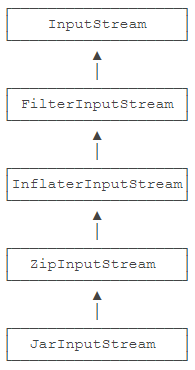

# yosoro~

IO 是指 Input/Output，即输入和输出，以内存为中心：

- Input 指从外部读入数据到内存，例如，把文件从磁盘读取到内存，从网络读取数据到内存等
- Output 指把数据从内存输出到外部，例如，把数据从内存写入到文件，把数据从内存输出到网络等等

IO 流是一种顺序读写数据的模式，它的特点是单向流动

### InputStream / OutputStream

IO 流以 `byte` （字节）为最小单位，因此也称为**字节流**

### Reader / Writer

如果我们需要读写的是字符，并且字符不全是单字节表示的 ASCII 字符，则按照 `char` 来读写更方便，这种称为**字符流**，提供有 `Reader` 和 `Writer` 以最小单位 `char` 来传输

它们本质上是一个能自动编解码的 `InputStream` 和 `OutputStream`

### 同步和异步

同步 IO 是指读写 IO 时代码必须等待数据返回后才继续执行后续代码，它的优点时代码编写简单，缺点是 CPU 执行效率低

而异步 IO 是指读写 IO 时仅发出请求，然后立刻执行后续代码，它的优点是 CPU 执行效率高，缺点是代码编写复杂

`java.io` 提供了同步 IO，`java.nio` 提供了异步 IO

## File 对象

要构造一个 `File` 对象，需要传入文件路径：

```java
public class Main {
    public static void main(String[] args) {
        File f = new File("C:\\Windows\\notepad.exe");
        System.out.println(f);
    }
}
```

可以传入相对路径或绝对路径，注意路径分隔符有平台区别，在 Windows 下使用 `\\` 表示一个 `\`，但最好用静态变量 `File.separator` 来作为分隔符拼接字符串

File 对象有 3 中形式表示路径：

1. `getPath()` ：返回构造方法传入的路径
2. `getAbsolutePath()` ：返回绝对路径
3. `getCanonicalPath()` ：返回规范路径，即绝对路径中将 `.` 和 `..` 转换成标准的绝对路径后的路径

### 文件和目录

`File`对象既可以表示文件，也可以表示目录。特别要注意的是，构造一个`File`对象，即使传入的文件或目录不存在，代码也不会出错，因为构造一个`File`对象，并不会导致任何磁盘操作。只有当我们调用`File`对象的某些方法的时候，才真正进行磁盘操作。

调用`isFile()`，判断该`File`对象是否是一个已存在的文件，调用`isDirectory()`，判断该`File`对象是否是一个已存在的目录

判断文件的权限和大小方法：

- `boolean canRead()` ：是否可读
- `boolean canWrite()` ：是否可写
- `boolean canExecute()` ：是否可执行
- `long length()` ：文件字节大小

### 创建和删除文件

当 File 对象表示一个**文件**时，可以通过 `createNewFile()` 创建一个新文件，用 `delete()` 删除该文件

希望处理临时文件可以使用 `createTempFile()` 和 `deleteOnExit()` 在 JVM 退出时自动删除该文件

### 遍历文件和目录

当 File 对象表示一个目录时，可以使用 `list()` 和 `listFiles()` 列出牡蛎下的文件和子目录名

`listFiles()` 提供了一系列重载方法，可以过滤不想要的文件和目录

创建和删除目录方法：

- `boolean mkdir()` ：创建当前 File 对象表示的目录
- `boolean mkdirs()` ：创建当前 File 对象表示的目录，并在必要时将不存在的父目录也创建出来
- `boolean delete()` ：删除当前 File 对象表示的目录，当前目录必须为空才能删除成功

### Path

Java 标准库还提供了一个 `Path` 对象位于 `java.nio.file` 包

```java
public class Main {
    public static void main(String[] args) throws IOException {
        Path p1 = Paths.get(".", "project", "study"); // 构造一个Path对象
        System.out.println(p1);
        Path p2 = p1.toAbsolutePath(); // 转换为绝对路径
        System.out.println(p2);
        Path p3 = p2.normalize(); // 转换为规范路径
        System.out.println(p3);
        File f = p3.toFile(); // 转换为File对象
        System.out.println(f);
        for (Path p : Paths.get("..").toAbsolutePath()) { // 可以直接遍历Path
            System.out.println("  " + p);
        }
    }
}
```

## InputStream

是一个**抽象类**，是所有输入流的超类，最重要的一个方法就是 `int read()` ：

```java
public abstract int read() throws IOException;
```

这个方法会读取输入流的下一个字节，并返回字节表示的 `int` 值（0~255),如果已读到末尾，返回 `-1` 表示不能继续读取了

`FileInputStream`是`InputStream`的一个子类。顾名思义，`FileInputStream`就是从文件流中读取数据

```java
public void readFile() throws IOException {
    // 创建一个FileInputStream对象:
    InputStream input = new FileInputStream("src/readme.txt");
    for (;;) {
        int n = input.read(); // 反复调用read()方法，直到返回-1
        if (n == -1) {
            break;
        }
        System.out.println(n); // 打印byte的值
    }
    input.close(); // 关闭流，非常必要，最好写在 try ... catch 中
}
```

我们还要注意到在读取或写入IO流的过程中，可能会发生错误，例如，文件不存在导致无法读取，没有写权限导致写入失败，等等，这些底层错误由Java虚拟机自动封装成IOException异常并抛出。因此，所有与IO操作相关的代码都必须正确处理IOException

最好写在 Java 7 中引入的新的 `try(resource)` 语法中

```java
public void readFile() throws IOException {
    try (InputStream input = new FileInputStream("src/readme.txt")) {
        int n;
        while ((n = input.read()) != -1) {
            System.out.println(n);
        }
    } // 编译器在此自动威威i们写入 finally 并调用 close()
}
```

我们还要注意到在读取或写入IO流的过程中，可能会发生错误，例如，文件不存在导致无法读取，没有写权限导致写入失败，等等，这些底层错误由Java虚拟机自动封装成IOException异常并抛出。因此，所有与IO操作相关的代码都必须正确处理IOException

### 缓冲

一次性读取多个字节到缓冲区，`InputStream` 提供了两个重载方法来读取多个字节：

- `int read(byte[] b)` ：读取若干字节并填充到 `byte[]` 数组，返回读取的字节数
- `int read(byte[] b, int off. int len)` ：指定 `byte[]` 数组的偏移量和最大填充数

利用上述方法一次读取多个字节时，需要先定义一个byte[]数组作为缓冲区，read()方法会尽可能多地读取字节到缓冲区， 但不会超过缓冲区的大小。read()方法的返回值不再是字节的int值，而是返回实际读取了多少个字节。如果返回-1，表示没有更多的数据了

```java
public void readFile() throws IOException {
    try (InputStream input = new FileInputStream("src/readme.txt")) {
        // 定义1000个字节大小的缓冲区:
        byte[] buffer = new byte[1000];
        int n;
        while ((n = input.read(buffer)) != -1) { // 读取到缓冲区
            System.out.println("read " + n + " bytes.");
        }
    }
}
```

### 阻塞

`read()` 方法是阻塞（Blocking）的，必须等 `read()` 执行完毕才执行后续代码

### InputStream 实现类

`FileInputStream` 和 `ByteArrayInputStream`（在内存中模拟一个 inputstream）

后者实际上是把一个 `byte[]` 数组在内存中变成一个 `InputStream` ，可以在测试时使用替代文件创建

## OutputStream

也是抽象类，是所有输出流的超类

```java
public abstract void write(int b) throws IOException;
```

仅写入一个字节 `int` 最低 8 位表示字节的部分（相当于 `b & 0xff`）

输出流默认会有缓冲区，在写满或关闭流时会强制输出内容，但有时也需要调用 `flush()` 方法强制输出缓冲区内容（如聊天室）而实际上输入流也有缓冲区

### FileOutputStream

使用重载的方法 `void write(byte[])` 一次性写入若干字节

```java
public void writeFile() throws IOException {
    try (OutputStream output = new FileOutputStream("out/readme.txt")) {
        output.write("Hello".getBytes("UTF-8")); // Hello
    } // 编译器在此自动为我们写入finally并调用close()
}
```

### 阻塞

同样会阻塞

### OutputStream 实现类

`FileOutputStream` 和 `ByteArrayOutputStream` 类似

## Filter 模式

Java 的 IO 标准库提供的 `InputStream` 根据来源可以包括

- `FileInputStream` ：从文件读取数据，是最终数据源
- `ServletInputStream` ：从 HTTP 请求读取数据，是最终数据源
- `Socket.getInputStream()` ：从 TCP 连接读取数据，是最终数据源


如果分别继承来给 Stream 添加不同的功能会造成过于复杂的继承树，因此有一种 **Filter 模式**：通过一个“基础”组件再叠加各种“附加”功能组件的模式（或装饰器模式：Decorator）


`OutputStream` 也是类似上面的模式

### 编写 FilterInputStream

可以自己编写，实现不同的功能

```java
public class Main {
    public static void main(String[] args) throws IOException {
        byte[] data = "hello, world!".getBytes("UTF-8");
        try (CountInputStream input = new CountInputStream(new ByteArrayInputStream(data))) {
            int n;
            while ((n = input.read()) != -1) {
                System.out.println((char)n);
            }
            System.out.println("Total read " + input.getBytesRead() + " bytes");
        }
    }
}

class CountInputStream extends FilterInputStream {
    private int count = 0;

    CountInputStream(InputStream in) {
        super(in);
    }

    public int getBytesRead() {
        return this.count;
    }

    public int read() throws IOException {
        int n = in.read();
        if (n != -1) {
            this.count ++;
        }
        return n;
    }

    public int read(byte[] b, int off, int len) throws IOException {
        int n = in.read(b, off, len);
        if (n != -1) {
            this.count += n;
        }
        return n;
    }
}
```

## 操作 Zip



`ZipInputStream` 可以直接读取 zip 包的内容；

派生的 `JarInputStream` 可以直接从 jar 文件读取 `MANIFEST.MF` 文件

### 读取 zip 包

要创建一个`ZipInputStream`，通常是传入一个`FileInputStream`作为数据源，然后，循环调用`getNextEntry()`，直到返回`null`，表示zip流结束

一个`ZipEntry`表示一个压缩文件或目录，如果是压缩文件，我们就用`read()`方法不断读取，直到返回`-1`：

```java
try (ZipInputStream zip = new ZipInputStream(new FileInputStream(...))) {
    ZipEntry entry = null;
    while ((entry = zip.getNextEntry()) != null) {
        String name = entry.getName();
        if (!entry.isDirectory()) {
            int n;
            while ((n = zip.read()) != -1) {
                ...
            }
        }
    }
}
```

### 写入 zip 包

`ZipOutputStream`是一种`FilterOutputStream`，它可以直接写入内容到zip包。我们要先创建一个`ZipOutputStream`，通常是包装一个`FileOutputStream`，然后，每写入一个文件前，先调用`putNextEntry()`，然后用`write()`写入`byte[]`数据，写入完毕后调用`closeEntry()`结束这个文件的打包

```JAVA
try (ZipOutputStream zip = new ZipOutputStream(new FileOutputStream(...))) {
    File[] files = ... // 这些文件用相对路径来实现目录层次结构
    for (File file : files) {
        zip.putNextEntry(new ZipEntry(file.getName()));
        zip.write(getFileDataAsBytes(file));
        zip.closeEntry();
    }
}
```

## 读取 classpath 资源

为了应对不同操作系统下目录的差异性，可以在 classpath 下存放

在classpath中的资源文件，路径总是以 `/` 开头，我们先获取当前的 `Class` 对象，然后调用`getResourceAsStream() `就可以直接从classpath读取任意的资源文件：

```java
try (InputStream input = getClass().getResourceAsStream("/default.properties")) {
    if (input != null) {
		// TODO:    
    }
}
```

调用`getResourceAsStream()`需要特别注意的一点是，如果资源文件不存在，它将返回`null`。因此，我们需要检查返回的`InputStream`是否为`null`，如果为`null`，表示资源文件在classpath中没有找到

如果我们把默认的配置放到jar包中，再从外部文件系统读取一个可选的配置文件，就可以做到既有默认的配置文件，又可以让用户自己修改配置：

```java
Properties props = new Properties();
props.load(inputStreamFromClassPath("/default.properties"));
props.load(inputStreamFromFile("./conf.properties"));
```

## 序列化

序列化是指把一个 Java 对象变成二进制内容，本质上就是一个 `byte[]` 数组

一个Java对象要能序列化，必须实现一个特殊的`java.io.Serializable`接口，它的定义如下：

```java
public interface Serializable {
}
```

`Serializable`接口没有定义任何方法，它是一个空接口。我们把这样的空接口称为“标记接口”（Marker Interface），实现了标记接口的类仅仅是给自身贴了个“标记”，并没有增加任何方法

### 序列化

把一个Java对象变为`byte[]`数组，需要使用`ObjectOutputStream`。它负责把一个Java对象写入一个字节流：

```java
public class Main {
    public static void main(String[] args) throws IOException {
        ByteArrayOutputStream buffer = new ByteArrayOutputStream();
        try (ObjectOutputStream output = new ObjectOutputStream(buffer)) {
            // 写入int:
            output.writeInt(12345);
            // 写入String:
            output.writeUTF("Hello");
            // 写入Object:
            output.writeObject(Double.valueOf(123.456));
        }
        System.out.println(Arrays.toString(buffer.toByteArray()));
    }
}
```

`ObjectOutputStream`既可以写入基本类型，如`int`，`boolean`，也可以写入`String`（以UTF-8编码），还可以写入实现了`Serializable`接口的`Object`。因为写入`Object`时需要大量的类型信息，所以写入的内容很大。

### 反序列化

和`ObjectOutputStream`相反，`ObjectInputStream`负责从一个字节流读取Java对象：

```java
try (ObjectInputStream input = new ObjectInputStream(...)) {
    int n = input.readInt();
    String s = input.readUTF();
    Double d = (Double) input.readObject();
}
```

调用 `readObject()` 可以直接返回一个 `Object` 对象，要获得特定类型必须强制转型

`readObject()` 可能抛出的异常有：

- `ClassNotFoundException` ：没有找到对应的 Class （不同设备上未定义类）
- `InvalidClassException` ：Class 不匹配（字段类型被修改）

为了避免这种class定义变动导致的不兼容，Java的序列化允许class定义一个特殊的`serialVersionUID`静态变量，用于标识Java类的序列化“版本”，通常可以由IDE自动生成。如果增加或修改了字段，可以改变`serialVersionUID`的值，这样就能自动阻止不匹配的class版本：

```java
public class Person implements Serializable {
    private static final long serialVersionUID = 2709425275741743919L;
}
```

要特别注意反序列化的几个**重要特点**：反序列化时，由JVM直接构造出Java对象，不调用构造方法，构造方法内部的代码，在反序列化时根本不可能执行。

### 安全性

一个精心构造的`byte[]`数组被反序列化后可以执行特定的Java代码，从而导致严重的安全漏洞。

实际上，Java本身提供的基于对象的序列化和反序列化机制既存在安全性问题，也存在兼容性问题。更好的序列化方法是通过JSON这样的通用数据结构来实现，只输出基本类型（包括String）的内容，而不存储任何与代码相关的信息。

## Reader

`Reader` 是字符流，以 `char` 为单位读取

| InputStream                         | Reader                                |
| :---------------------------------- | :------------------------------------ |
| 字节流，以`byte`为单位              | 字符流，以`char`为单位                |
| 读取字节（-1，0~255）：`int read()` | 读取字符（-1，0~65535）：`int read()` |
| 读到字节数组：`int read(byte[] b)`  | 读到字符数组：`int read(char[] c)`    |

`java.io.Reader` 是所有字符输入流的超类，最主要的方法是：

```java
public int read() throws IOException;
```

这个方法读取字符流的下一个字符，并返回字符表示的`int`，范围是`0`~`65535`。如果已读到末尾，返回`-1`

### FileReader

是 `Reader` 的一个子类，可以打开文件并获取 `Reader` 

如果文件中包含中文，就会出现乱码，因为`FileReader`默认的编码与系统相关，例如，Windows系统的默认编码可能是`GBK`，打开一个`UTF-8`编码的文本文件就会出现乱码

构造方法中可以传入传入文件和编码（可选的），同样最好用 `try (resource)` 打开最好

```java
public void readFile() throws IOException {
    // 创建一个FileReader对象:
    Reader reader = new FileReader("src/readme.txt", StandardCharsets.UTF_8 // 字符编码是???
    for (;;) {
        int n = reader.read(); // 反复调用read()方法，直到返回-1
        if (n == -1) {
            break;
        }
        System.out.println((char)n); // 打印char
    }
    reader.close(); // 关闭流
}
```

同样有一次性读取若干字符并填充到 `char[]` 数组的方法重载，返回实际读入的字符个数，返回 `-1` 表示流结束：

```java
public int read(char[] c) throws IOException
```

### CharArrayReader

`CharArrayReader`可以在内存中模拟一个`Reader`，它的作用实际上是把一个`char[]`数组变成一个`Reader`，这和`ByteArrayInputStream`非常类似：

### StringReader

`StringReader`可以直接把`String`作为数据源，它和`CharArrayReader`几乎一样

### InputStreamReader

除了特殊的`CharArrayReader`和`StringReader`，普通的`Reader`实际上是基于`InputStream`构造的，因为`Reader`需要从`InputStream`中读入字节流（`byte`），然后，根据编码设置，再转换为`char`就可以实现字符流。如果我们查看`FileReader`的源码，它在内部实际上持有一个`FileInputStream`

`InputStreamReader`就是这样一个转换器，它可以把任何`InputStream`转换为`Reader`，构造`InputStreamReader`时，我们需要传入`InputStream`，还需要指定编码，就可以得到一个`Reader`对象

```java
try (Reader reader = new InputStreamReader(new FileInputStream("src/readme.txt"), "UTF-8")) {}
```

## Writer

`Writer`就是带编码转换器的`OutputStream`，它把`char`转换为`byte`并输出

| OutputStream                           | Writer                                   |
| :------------------------------------- | :--------------------------------------- |
| 字节流，以`byte`为单位                 | 字符流，以`char`为单位                   |
| 写入字节（0~255）：`void write(int b)` | 写入字符（0~65535）：`void write(int c)` |
| 写入字节数组：`void write(byte[] b)`   | 写入字符数组：`void write(char[] c)`     |
| 无对应方法                             | 写入String：`void write(String s)`       |

`Writer`是所有字符输出流的超类，它提供的方法主要有：

- 写入一个字符（0~65535）：`void write(int c)`
- 写入字符数组的所有字符：`void write(char[] c)`
- 写入 String 表示的所有字符：`void write(String s)`

### FileWriter

`FileWriter`就是向文件中写入字符流的`Writer`。它的使用方法和`FileReader`类似

```java
Writer writer = new FileWriter("readme.txt", StandardCharsets.UTF_8) // 后续调用 write() 方法
```

### CharArrayWriter

`CharArrayWriter`可以在内存中创建一个`Writer`，它的作用实际上是构造一个缓冲区，可以写入`char`，最后得到写入的`char[]`数组，这和`ByteArrayOutputStream`非常类似

### StringWriter

`StringWriter`也是一个基于内存的`Writer`，它和`CharArrayWriter`类似。实际上，`StringWriter`在内部维护了一个`StringBuffer`，并对外提供了`Writer`接口

### OutputStreamWriter

除了`CharArrayWriter`和`StringWriter`外，普通的Writer实际上是基于`OutputStream`构造的，它接收`char`，然后在内部自动转换成一个或多个`byte`，并写入`OutputStream`。因此，`OutputStreamWriter`就是一个将任意的`OutputStream`转换为`Writer`的转换器：

```java
try (Writer writer = new OutputStreamWriter(new FileOutputStream("readme.txt"), "UTF-8") {}
```

## PrintStream 和 PrintWriter

`PrintStream` 是一种 `FilterOutputStream` ，它在`OutputStream`的接口上，额外提供了一些写入各种数据类型的方法：

- 写入`int`：`print(int)`
- 写入`boolean`：`print(boolean)`
- 写入`String`：`print(String)`
- 写入`Object`：`print(Object)`，实际上相当于`print(object.toString())`
- ...

以及对应的一组`println()`方法，它会自动加上换行符

我们经常使用的`System.out.println()`实际上就是使用`PrintStream`打印各种数据，`System.err`是系统默认提供的标准错误输出

### PrintWriter

`PrintStream`最终输出的总是byte数据，而`PrintWriter`则是扩展了`Writer`接口，它的`print()`/`println()`方法最终输出的是`char`数据。两者的使用方法几乎是一模一样的：

```java
public class Main {
    public static void main(String[] args)     {
        StringWriter buffer = new StringWriter();
        try (PrintWriter pw = new PrintWriter(buffer)) {
            pw.println("Hello");
            pw.println(12345);
            pw.println(true);
        }
        System.out.println(buffer.toString());
    }
}
```

## 使用 File

从Java 7开始，提供了`Files`和`Paths`这两个工具类来自 `java.nio`，能极大地方便我们读写文件

```java
// 读取为 byte[]
byte[] data = Files.readAllBytes(Paths.get("/path/to/file.txt"));
// 默认使用UTF-8编码读取:
String content1 = Files.readString(Paths.get("/path/to/file.txt"));
// 可指定编码:
String content2 = Files.readString(Paths.get("/path/to/file.txt"), StandardCharsets.ISO_8859_1);
// 按行读取并返回每行内容:
List<String> lines = Files.readAllLines(Paths.get("/path/to/file.txt"));
```

写入文件操作

```java
// 写入二进制文件:
byte[] data = ...
Files.write(Paths.get("/path/to/file.txt"), data);
// 写入文本并指定编码:
Files.writeString(Paths.get("/path/to/file.txt"), "文本内容...", StandardCharsets.ISO_8859_1);
// 按行写入文本:
List<String> lines = ...
Files.write(Paths.get("/path/to/file.txt"), lines);
```

此外，`Files`工具类还有`copy()`、`delete()`、`exists()`、`move()`等快捷方法操作文件和目录

