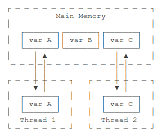
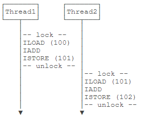
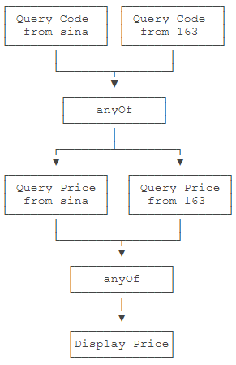

# yosoro~

多线程是 Java 最基本的一种并发模型

## 多线程基础

现代操作系统（Windows，macOS，Linux）都可以执行多任务。多任务就是同时运行多个任务，CPU执行代码都是一条一条顺序执行的，但是，即使是单核cpu，也可以同时运行多个任务。因为操作系统执行多任务实际上就是让CPU对多个任务轮流交替执行。

即使是多核CPU，因为通常任务的数量远远多于CPU的核数，所以任务也是交替执行的。

### 进程 Process

在计算机中，我们把一个任务称为一个**进程**，浏览器就是一个进程，视频播放器是另一个进程，类似的，音乐播放器和Word都是进程。

某些进程内部还需要同时执行多个子任务。例如，我们在使用Word时，Word可以让我们一边打字，一边进行拼写检查，同时还可以在后台进行打印，我们把子任务称为**线程**。

进程和线程的关系就是：**一个进程可以包含一个或多个线程，但至少会有一个线程**

操作系统调度的最小任务单位其实不是进程，而是线程。常用的Windows、Linux等操作系统都采用抢占式多任务，如何调度线程完全由操作系统决定，程序自己不能决定什么时候执行，以及执行多长时间。

实现多任务有几种方法：

- 多进程模式：每个进程只有一个线程
- 多线程模式：一个进程有多个线程
- 多进程 + 多线程模式：复杂度最高

### 进程 VS 线程

和多线程相比，多进程的缺点在于：

- 创建进程比创建线程开销大，尤其是在Windows系统上；
- 进程间通信比线程间通信要慢，因为线程间通信就是读写同一个变量，速度很快。

而多进程的优点在于：

- 多进程稳定性比多线程高，因为在多进程的情况下，一个进程崩溃不会影响其他进程，而在多线程的情况下，任何一个线程崩溃会直接导致整个进程崩溃。

### 多线程

Java语言内置了多线程支持：一个Java程序实际上是一个JVM进程，JVM进程用一个主线程来执行`main()`方法，在`main()`方法内部，我们又可以启动多个线程。此外，JVM还有负责**垃圾回收**的其他工作线程等

和单线程相比，多线程编程的特点在于：多线程经常需要读写共享数据，并且需要同步。例如，播放电影时，就必须由一个线程播放视频，另一个线程播放音频，两个线程需要协调运行，否则画面和声音就不同步。因此，多线程编程的复杂度高，调试更困难。

Java多线程编程的特点又在于：

- 多线程模型是Java程序最基本的并发模型；
- 后续读写网络、数据库、Web开发等都依赖Java多线程模型。

## 创建新线程

Java语言内置了多线程支持。当Java程序启动的时候，实际上是启动了一个JVM进程，然后，JVM启动主线程来执行`main()`方法。在`main()`方法中，我们又可以启动其他线程。

实例化一个 `Thread` 并调用其 `start()` 方法启动新线程；实际上 `start()` 方法会创建一个新线程并内部调用 `run()` 方法，故通常自建线程类继承自 `Thread` 并覆写 `run()` 方法（仅调用 `run()` 方法可以执行但不会启动新线程）

```java
public class Main {
    public static void main(String[] args) {
        Thread t = new MyThread();
        t.start(); // 启动新线程
    }
}
class MyThread extends Thread {
    @Override
    public void run() {
        System.out.println("start new thread!");
    }
}
```

或者可以在创建 `Thread` 实例时传入一个 `Runnable` 实例：

```java
public class Main {
    public static void main(String[] args) {
        Thread t = new Thread(new MyRunnable());
        t.start(); // 启动新线程
    }
}
class MyRunnable implements Runnable {
    @Override
    public void run() {
        System.out.println("start new thread!");
    }
}
```

或者用 Java8 引入的 lambda 语法进一步简写为

```java
public class Main {
    public static void main(String[] args) {
        Thread t = new Thread(() -> {
            System.out.println("start new thread!");
        });
        t.start(); // 启动新线程
    }
}
```

需要注意的是，以上方法启动的线程会在 JVM 执行的 `main()` 主线程平行处运行，故代码的执行顺序互不影响且不能完全确定

`Thread.sleep()` 可传入毫秒值来暂停线程

### 线程的优先级

```java
Thread.setPriority(int n); // 1~10，默认值 5
```

优先级并不确保一定先执行，只是提高概率

## 线程的状态

一个线程对象只能调用一次`start()`方法启动新线程，并在新线程中执行`run()`方法。一旦`run()`方法执行完毕，线程就结束了。因此，Java线程的状态有以下几种：

- New：新创建的线程，尚未执行；
- Runnable：运行中的线程，正在执行`run()`方法的Java代码；
- Blocked：运行中的线程，因为某些操作被阻塞而挂起；
- Waiting：运行中的线程，因为某些操作在等待中；
- Timed Waiting：运行中的线程，因为执行`sleep()`方法正在计时等待；
- Terminated：线程已终止，因为`run()`方法执行完毕。

线程终止的原因有：

- 线程正常终止：`run()`方法执行到`return`语句返回；
- 线程意外终止：`run()`方法因为未捕获的异常导致线程终止；
- 对某个线程的`Thread`实例调用`stop()`方法强制终止（强烈不推荐使用）。

一个线程还可以等待另一个线程直到其运行结束，如下是 `main` 线程等待 `t` 线程

```java
public class Main {
    public static void main(String[] args) throws InterruptedException {
        Thread t = new Thread(() -> {
            System.out.println("hello");
        });
        System.out.println("start");
        t.start();
        t.join(); // 此处执行 main 等待
        System.out.println("end");
    }
}
```

`join(long)`的重载方法也可以指定一个等待时间，超过等待时间后就不再继续等待。

## 中断线程

中断一个线程非常简单，只需要在其他线程中对目标线程调用`interrupt()`方法，目标线程需要反复检测自身状态是否是interrupted状态，如果是，就立刻结束运行

```java
public class Main {
    public static void main(String[] args) throws InterruptedException {
        Thread t = new MyThread();
        t.start();
        Thread.sleep(1); // 暂停1毫秒
        t.interrupt(); // 发出中断请求
        t.join(); // 等待t线程结束
        System.out.println("end");
    }
}

class MyThread extends Thread {
    public void run() {
        int n = 0;
        while (! isInterrupted()) { // 当接到中断请求时中断
            n ++;
            System.out.println(n + " hello!");
        }
    }
}
```

如果线程处于等待状态，例如，`t.join()`会让`main`线程进入等待状态，此时，如果对`main`线程调用`interrupt()`，`join()`方法会立刻抛出`InterruptedException`，因此，目标线程只要捕获到`join()`方法抛出的`InterruptedException`，就说明有其他线程对其调用了`interrupt()`方法，通常情况下该线程应该立刻结束运行。

```java
public class Main {
    public static void main(String[] args) throws InterruptedException {
        Thread t = new MyThread();
        t.start();
        Thread.sleep(1000);
        t.interrupt(); // 中断t线程
        t.join(); // 等待t线程结束
        System.out.println("end");
    }
}

class MyThread extends Thread {
    public void run() {
        Thread hello = new HelloThread();
        hello.start(); // 启动hello线程
        try {
            hello.join(); // 等待hello线程结束
        } catch (InterruptedException e) {
            System.out.println("interrupted!");
        }
        hello.interrupt();
    }
}

class HelloThread extends Thread {
    public void run() {
        int n = 0;
        while (!isInterrupted()) {
            n++;
            System.out.println(n + " hello!");
            try {
                Thread.sleep(100);
            } catch (InterruptedException e) {
                break;
            }
        }
    }
}
```

### 另一个中断方法

设置标志位，用一个 `running` 标志位来标识线程是否应该继续运行，在外部线程中，通过把 `HelloThread.running` 置为 `false` 就可以让线程结束

```java
public class Main {
    public static void main(String[] args)  throws InterruptedException {
        HelloThread t = new HelloThread();
        t.start();
        Thread.sleep(1);
        t.running = false; // 标志位置为false
    }
}
class HelloThread extends Thread {
    public volatile boolean running = true; // 标志为 volatile 才能线程间共享
    public void run() {
        int n = 0;
        while (running) {
            n ++;
            System.out.println(n + " hello!");
        }
        System.out.println("end!");
    }
}
```

线程间共享变量需要使用`volatile`关键字标记，确保每个线程都能读取到更新后的变量值。



在Java虚拟机中，变量的值保存在主内存中，但是，当线程访问变量时，它会先获取一个副本，并保存在自己的工作内存中。如果线程修改了变量的值，虚拟机会在某个时刻把修改后的值回写到主内存，但是，这个时间是不确定的！

这会导致如果一个线程更新了某个变量，另一个线程读取的值可能还是更新前的。例如，主内存的变量`a = true`，线程1执行`a = false`时，它在此刻仅仅是把变量`a`的副本变成了`false`，主内存的变量`a`还是`true`，在JVM把修改后的`a`回写到主内存之前，其他线程读取到的`a`的值仍然是`true`，这就造成了多线程之间共享的变量不一致。

因此，`volatile`关键字的目的是告诉虚拟机：

- 每次访问变量时，总是获取主内存的最新值；
- 每次修改变量后，立刻回写到主内存。

`volatile`关键字解决的是可见性问题：当一个线程修改了某个共享变量的值，其他线程能够立刻看到修改后的值。

如果我们去掉`volatile`关键字，运行上述程序，发现效果和带`volatile`差不多，这是因为在x86的架构下，JVM回写主内存的速度非常快，但是，换成ARM的架构，就会有显著的延迟。

## 守护线程

如果有一个线程没有退出，JVM进程就不会退出。所以，必须保证所有线程都能及时结束。

但是有一种线程的目的就是无限循环，例如，一个定时触发任务的线程：

```java
class TimerThread extends Thread {
    @Override
    public void run() {
        while (true) {
            System.out.println(LocalTime.now());
            try {
                Thread.sleep(1000);
            } catch (InterruptedException e) {
                break;
            }
        }
    }
}
```

对于此类线程，我们希望在其他线程结束时能结束它以关闭 JVM 进程

为此需要使用到 **守护线程（Daemon Thread）** ，指为其他线程服务的线程。在JVM中，所有非守护线程都执行完毕后，无论有没有守护线程，虚拟机都会自动退出。即 JVM 退出时不在乎守护线程是否结束

在**调用 `start()` 方法前**调用 `setDaemon(true)` 即可

```java
Thread t = new MyThread();
t.setDaemon(true);
t.start();
```

## 线程同步

当多个线程同时运行时，线程的调度由操作系统决定，程序本身无法决定。如果多个线程**同时读写共享变量**（比如一个类的静态属性），会出现数据不一致的问题。

多线程模型下，要保证逻辑正确，对共享变量进行读写时，必须保证一组指令以原子方式执行：即某一个线程执行时，其他线程必须等待：

通过加锁和解锁的操作，能保证 3 条指令总是在一个线程执行期间，不会有其他线程会进入此指令区间。即使在执行期线程被操作系统中断执行，其他线程也会因为无法获得锁导致无法进入此指令区间。只有执行线程将锁释放后，其他线程才有机会获得锁并执行。这种加锁和解锁之间的代码块我们称之为**临界区（Critical Section）**，任何时候临界区最多只有一个线程能执行。

Java 程序使用 `synchronized` 关键字对一个对象进行加锁，其保证了**代码块**在任意时刻最多只有一个线程能执行（可以指定对象如 obj.lock 区分用途，但要确保锁住同一个对象）：**同步会降低效率**

```java
synchronized(lock) {
    n = n + 1;
}
```

简单使用方法：

1. 找出修改共享变量的线程代码块；
2. 选择一个共享实例作为锁；
3. 使用 `synchronized(lockObject) {...}`

注意：

- 无论是否异常，都会在代码块末尾正确释放锁
- 总是按需要分组锁，修改同一组变量时视情况用一组锁

### 不需要 synchronized 的操作

JVM 规范定义了几种原子操作：

- 基本类型（`long`和`double`除外）赋值，例如：`int n = m`；
- 引用类型赋值，例如：`List<String> list = anotherList`。

`long`和`double`是64位数据，JVM没有明确规定64位赋值操作是不是一个原子操作，不过在x64平台的JVM是把`long`和`double`的赋值作为原子操作实现的。

**单条原子操作的语句不需要同步**

## 同步方法

更好的做法是把 `synchronized` 逻辑封装到方法里

```java
public class Counter {
    private int count = 0;
    public void add(int n) {
        synchronized(this) {
            count += n;
        }
    }
    public void dec(int n) {
        synchronized(this) {
            count -= n;
        }
    }
    public int get() {
        return count;
    }
}
```

上述代码锁住当前实例 `this` ，当创建多个 `Counter` 实例互不影响

### 线程安全

如果一个类被设计为允许多线程正确访问，则称其为“线程安全”的（thread-safe）如有 `java.lang.StringBuffer` 

一些不变类如`String`，`Integer`，`LocalDate`，它们的所有成员变量都是`final`，多线程同时访问时只能读不能写，这些不变类也是线程安全的。

最后，类似`Math`这些只提供静态方法，没有成员变量的类，也是线程安全的。

**没有特殊说明时，一个类默认是非线程安全的。**

### 同步方法

用`synchronized`修饰的方法就是同步方法，它表示**整个方法**都必须用`this`实例加锁。

```java
public synchronized void add(int n) { // 锁住this
    count += n;
} // 解锁
```

对`static`方法添加`synchronized`，锁住的是该类的`Class`实例。

- 凡是仅读取值的都可以设计成非线程安全，有写入时则要注意

## 死锁

Java 的线程锁是**可重入**的锁：同一个线程可以反复获取同一个锁（如在方法内递归调用）

由于Java的线程锁是可重入锁，所以，获取锁的时候，不但要判断是否是第一次获取，还要记录这是第几次获取。每获取一次锁，记录+1，每退出`synchronized`块，记录-1，减到0的时候，才会真正释放锁。

### 死锁

一个线程可以获取一个锁后，再继续获取另一个锁。例如：

```java
public void add(int m) {
    synchronized(lockA) { // 获得lockA的锁
        this.value += m;
        synchronized(lockB) { // 获得lockB的锁
            this.another += m;
        } // 释放lockB的锁
    } // 释放lockA的锁
}

public void dec(int m) {
    synchronized(lockB) { // 获得lockB的锁
        this.another -= m;
        synchronized(lockA) { // 获得lockA的锁
            this.value -= m;
        } // 释放lockA的锁
    } // 释放lockB的锁
}
```

两个线程各自持有不同的锁，然后各自试图获取对方手里的锁，造成了双方无限等待下去，这就是死锁。

死锁发生后，没有任何机制能解除死锁，只能强制结束JVM进程。

为了避免死锁，线程获取锁的顺序要一致。即严格按照先获取`lockA`，再获取`lockB`的顺序，

## 实用技巧

### 使用 wait 和 notify

多线程协调运行的原则就是：当条件不满足时，线程进入等待状态；当条件满足时，线程被唤醒，继续执行任务。

始终在 `while` 语句中执行 `wait()` ，因为可能多个等待线程同时被唤醒，需要在抢占锁后其余继续等待

```java
class TaskQueue {
    Queue<String> queue = new LinkedList<>();

    public synchronized void addTask(String s) {
        this.queue.add(s);
        this.notify(); // 唤醒在 this 锁等待的线程
    }

    public synchronized String getTask() {
        while (queue.isEmpty()) {
            // 释放 this 锁
            this.wait();
            // 重新获取 this 锁
        }
        return queue.remove();
    }
}
```

关键在于，`wait()` 必须在当前获取的锁对象上调用。

调用`wait()`方法后，线程进入等待状态，`wait()`方法不会返回，直到将来某个时刻，线程从等待状态被其他线程唤醒后，`wait()`方法才会返回，然后，继续执行下一条语句。

`wait()`方法的执行机制非常复杂。首先，它不是一个普通的Java方法，而是定义在`Object`类的一个`native`方法，也就是由JVM的C代码实现的。其次，必须在`synchronized`块中才能调用`wait()`方法，因为`wait()`方法调用时，会*释放*线程获得的锁，`wait()`方法返回后，线程又会重新试图获得锁。

使用`notifyAll()`将唤醒所有当前正在`this`锁等待的线程，而`notify()`只会唤醒其中一个（具体哪个依赖操作系统，有一定的随机性）。这是因为可能有多个线程正在`getTask()`方法内部的`wait()`中等待，使用`notifyAll()`将一次性全部唤醒。通常来说，`notifyAll()`更安全。有些时候，如果我们的代码逻辑考虑不周，用`notify()`会导致只唤醒了一个线程，而其他线程可能永远等待下去醒不过来了。

### 使用 ReentrantLock

从 Java 5 开始，引入了一个高级的处理并发的 `java.util.concurrent` 包，其下的 `locks` 包提供了 `ReentrantLock` 用于替代 `synchronized` 加锁，提供了大量更高级的并发功能。

```java
public class Counter {
    private final Lock lock = new ReentrantLock();
    private int count;
    public void add(int n) {
        lock.lock();
        try {
            count += n;
        } finally {
            lock.unlock(); // 由于是代码实现的锁，需要考虑异常
        }
    }
}
```

它是可重入锁，且可尝试获取锁：

```java
if (lock.tryLock(1, TimeUnit.SECONDS)) {
    try {
        ...
    } finally {
        lock.unlock();
    }
}
```

上述代码在尝试获取锁的时候，最多等待1秒。如果1秒后仍未获取到锁，`tryLock()`返回`false`，程序就可以做一些额外处理，而不是无限等待下去。所以，使用`ReentrantLock`比直接使用`synchronized`更安全，线程在`tryLock()`失败的时候不会导致死锁。

### 使用 Condition

辅助 `ReentrantLock` 实现 `wait` 和 `notify` 功能

```java
class TaskQueue {
    private final Lock lock = new ReentrantLock();
    private final Condition condition = lock.newCondition();
    private Queue<String> queue = new LinkedList<>();

    public void addTask(String s) {
        lock.lock();
        try {
            queue.add(s);
            condition.signalAll();
        } finally {
            lock.unlock();
        }
    }

    public String getTask() {
        lock.lock();
        try {
            while (queue.isEmpty()) {
                condition.await();
            }
            return queue.remove();
        } finally {
            lock.unlock();
        }
    }
}
```

使用`Condition`时，引用的`Condition`对象必须从`Lock`实例的`newCondition()`返回，这样才能获得一个绑定了`Lock`实例的`Condition`实例。

`Condition`提供的`await()`、`signal()`、`signalAll()`原理和`synchronized`锁对象的`wait()`、`notify()`、`notifyAll()`是一致的，并且其行为也是一样的：

- `await()`会释放当前锁，进入等待状态；可以设置等待时间
- `signal()`会唤醒某个等待线程；
- `signalAll()`会唤醒所有等待线程；
- 唤醒线程从`await()`返回后需要重新获得锁。

`condition.await(1, TimeUnit.SECOND)` 等待指定时间后可以自己醒来

### 使用 ReadWriteLock

之前的 `ReentrantLock` 保证了只有一个线程可以执行临界区代码，但实际上对仅读操作我们允许多个线程同时调用。

实际上我们想要的是：允许多个线程同时读，但只要有一个线程在写，其他线程就必须等待：

|      | 读     | 写     |
| :--- | :----- | :----- |
| 读   | 允许   | 不允许 |
| 写   | 不允许 | 不允许 |

使用`ReadWriteLock`可以解决这个问题，它保证：

- 只允许一个线程写入（其他线程既不能写入也不能读取）；
- 没有写入时，多个线程允许同时读（提高性能）。

创建一个`ReadWriteLock`实例，然后分别获取读锁和写锁：

```java
public class Counter {
    private final ReadWriteLock rwlock = new ReentrantReadWriteLock();
    private final Lock rlock = rwlock.readLock();
    private final Lock wlock = rwlock.writeLock();
    private int[] counts = new int[10];

    public void inc(int index) {
        wlock.lock(); // 加写锁
        try {
            counts[index] += 1;
        } finally {
            wlock.unlock(); // 释放写锁
        }
    }

    public int[] get() {
        rlock.lock(); // 加读锁
        try {
            return Arrays.copyOf(counts, counts.length);
        } finally {
            rlock.unlock(); // 释放读锁
        }
    }
}
```

使用`ReadWriteLock`时，适用条件是同一个数据，有大量线程读取，但仅有少数线程修改。

### 使用 StampedLock

如果我们深入分析`ReadWriteLock`，会发现它有个潜在的问题：如果有线程正在读，写线程需要等待读线程释放锁后才能获取写锁，即读的过程中不允许写，这是一种**悲观**的读锁。

要进一步提升并发执行效率，Java 8引入了新的读写锁：`StampedLock`。

`StampedLock`和`ReadWriteLock`相比，改进之处在于：读的过程中也允许获取写锁后写入！这样一来，我们读的数据就可能不一致，所以，需要一点额外的代码来判断读的过程中是否有写入，这种读锁是一种乐观锁。

**乐观锁**的意思就是乐观地估计读的过程中大概率不会有写入，因此被称为乐观锁。反过来，**悲观锁**则是读的过程中拒绝有写入，也就是写入必须等待。显然乐观锁的并发效率更高，但一旦有小概率的写入导致读取的数据不一致，需要能检测出来，再读一遍就行。

```java
public class Point {
    private final StampedLock stampedLock = new StampedLock();

    private double x;
    private double y;

    public void move(double deltaX, double deltaY) {
        long stamp = stampedLock.writeLock(); // 获取写锁
        try {
            x += deltaX;
            y += deltaY;
        } finally {
            stampedLock.unlockWrite(stamp); // 释放写锁
        }
    }

    public double distanceFromOrigin() {
        long stamp = stampedLock.tryOptimisticRead(); // 获得一个乐观读锁
        // 注意下面两行代码不是原子操作
        // 假设x,y = (100,200)
        double currentX = x;
        // 此处已读取到x=100，但x,y可能被写线程修改为(300,400)
        double currentY = y;
        // 此处已读取到y，如果没有写入，读取是正确的(100,200)
        // 如果有写入，读取是错误的(100,400)
        if (!stampedLock.validate(stamp)) { // 检查乐观读锁后是否有其他写锁发生
            stamp = stampedLock.readLock(); // 获取一个悲观读锁
            try {
                currentX = x;
                currentY = y;
            } finally {
                stampedLock.unlockRead(stamp); // 释放悲观读锁
            }
        }
        return Math.sqrt(currentX * currentX + currentY * currentY);
    }
}
```

和`ReadWriteLock`相比，写入的加锁是完全一样的，不同的是读取。注意到首先我们通过`tryOptimisticRead()`获取一个乐观读锁，并返回版本号。接着进行读取，读取完成后，我们通过`validate()`去验证版本号，如果在读取过程中没有写入，版本号不变，验证成功，我们就可以放心地继续后续操作。如果在读取过程中有写入，版本号会发生变化，验证将失败。在失败的时候，我们再通过获取悲观读锁再次读取。由于写入的概率不高，程序在绝大部分情况下可以通过乐观读锁获取数据，极少数情况下使用悲观读锁获取数据。

可见，`StampedLock`把读锁细分为乐观读和悲观读，能进一步提升并发效率。但这也是有代价的：一是代码更加复杂，二是`StampedLock`是不可重入锁，不能在一个线程中反复获取同一个锁。

`StampedLock`还提供了更复杂的将悲观读锁升级为写锁的功能，它主要使用在if-then-update的场景：即先读，如果读的数据满足条件，就返回，如果读的数据不满足条件，再尝试写。

### 使用 Concurrent 集合

`BlockingQueue`的意思就是说，当一个线程调用这个`TaskQueue`的`getTask()`方法时，该方法内部可能会让线程变成等待状态，直到队列条件满足不为空，线程被唤醒后，`getTask()`方法才会返回。

因为`BlockingQueue`非常有用，所以我们不必自己编写，可以直接使用Java标准库的`java.util.concurrent`包提供的线程安全的集合：`ArrayBlockingQueue`。

除了`BlockingQueue`外，针对`List`、`Map`、`Set`、`Deque`等，`java.util.concurrent`包也提供了对应的并发集合类。

| interface | non-thread-safe         | thread-safe                              |
| :-------- | :---------------------- | :--------------------------------------- |
| List      | ArrayList               | CopyOnWriteArrayList                     |
| Map       | HashMap                 | ConcurrentHashMap                        |
| Set       | HashSet / TreeSet       | CopyOnWriteArraySet                      |
| Queue     | ArrayDeque / LinkedList | ArrayBlockingQueue / LinkedBlockingQueue |
| Deque     | ArrayDeque / LinkedList | LinkedBlockingDeque                      |

使用这些并发集合与使用非线程安全的集合类完全相同。因为所有的同步和加锁的逻辑都在集合内部实现，对外部调用者来说，只需要正常按接口引用，其他代码和原来的非线程安全代码完全一样。我们以`ConcurrentHashMap`为例：

```java
Map<String, String> map = new ConcurrentHashMap<>();
// 在不同的线程读写:
map.put("A", "1");
map.put("B", "2");
map.get("A", "1");
```

而`java.util.Collections`工具类还提供了一个旧的线程安全集合转换器，实际上是用一个包装类包装了非线程安全的类，然后对所有读写方法都用`synchronized`加锁，不推荐

### 使用 Atomic

Java的`java.util.concurrent`包除了提供底层锁、并发集合外，还提供了一组原子操作的**封装类**，它们位于`java.util.concurrent.atomic`包。

我们以`AtomicInteger`为例，它提供的主要操作有：

- 增加值并返回新值：`int addAndGet(int delta)`
- 加1后返回新值：`int incrementAndGet()`
- 获取当前值：`int get()`
- 用CAS方式设置：`int compareAndSet(int expect, int update)`

Atomic类是通过无锁（lock-free）的方式实现的线程安全（thread-safe）访问。它的主要原理是利用了CAS：Compare and Set。方法类似如下，实际调用封装好的即可：

```java
public int incrementAndGet(AtomicInteger var) {
    int prev, next;
    do {
        prev = var.get();
        next = prev + 1;
    } while ( ! var.compareAndSet(prev, next));
    return next;
}
```

CAS是指，在这个操作中，如果`AtomicInteger`的当前值是`prev`，那么就更新为`next`，返回`true`。如果`AtomicInteger`的当前值不是`prev`，就什么也不干，返回`false`。通过CAS操作并配合`do ... while`循环，即使其他线程修改了`AtomicInteger`的值，最终的结果也是正确的。

在高度竞争的情况下，还可以使用Java 8提供的`LongAdder`和`LongAccumulator`。

### 使用线程池

接收大量小任务并进行分发处理的就是**线程池**。简单地说，线程池内部维护了若干个线程，没有任务的时候，这些线程都处于等待状态。如果有新任务，就分配一个空闲线程执行。如果所有线程都处于忙碌状态，新任务要么放入队列等待，要么增加一个新线程进行处理。

Java标准库提供了`ExecutorService`接口表示线程池，它的典型用法如下：

```java
// 创建固定大小的线程池:
ExecutorService executor = Executors.newFixedThreadPool(3);
// 提交任务:
executor.submit(task1);
executor.submit(task2);
executor.submit(task3);
executor.submit(task4);
executor.submit(task5);
```

因为`ExecutorService`只是接口，Java标准库提供的几个常用实现类有：

- FixedThreadPool：线程数固定的线程池；（下例）
- CachedThreadPool：线程数根据任务动态调整的线程池；
- SingleThreadExecutor：仅单线程执行的线程池。

```java
import java.util.concurrent.*;

public class Main {
    public static void main(String[] args) {
        // 创建一个固定大小的线程池:
        ExecutorService es = Executors.newFixedThreadPool(4);
        for (int i = 0; i < 6; i++) {
            es.submit(new Task("" + i));
        }
        // 关闭线程池:
        es.shutdown();
    }
}

class Task implements Runnable {
    private final String name;

    public Task(String name) {
        this.name = name;
    }

    @Override
    public void run() {
        System.out.println("start task " + name);
        try {
            Thread.sleep(1000);
        } catch (InterruptedException e) {
        }
        System.out.println("end task " + name);
    }
}
```

一次性放入6个任务，由于线程池只有固定的4个线程，因此，前4个任务会同时执行，等到有线程空闲后，才会执行后面的两个任务。

线程池在程序结束的时候要关闭。使用`shutdown()`方法关闭线程池的时候，它会**等待正在执行的任务先完成**，然后再关闭。`shutdownNow()`会立刻停止正在执行的任务，`awaitTermination()`则会等待指定的时间让线程池关闭。

想创建指定**动态范围**的线程池，可以这么写：

```java
int min = 4;
int max = 10;
ExecutorService es = new ThreadPoolExecutor(min, max,
        60L, TimeUnit.SECONDS, new SynchronousQueue<Runnable>());
```

#### ScheduledThreadPool

还有一种任务，需要定期反复执行，例如，每秒刷新证券价格。这种任务本身固定，需要反复执行的，可以使用`ScheduledThreadPool`。放入`ScheduledThreadPool`的任务可以定期反复执行。

```java
ScheduledExecutorService ses = Executors.newScheduledThreadPool(4);
// 指定 1 秒后执行一次任务：
ses.schedule(new Task("one-time"), 1, TimeUnit.SECONDS); 
// 2秒后开始执行定时任务，每3秒执行：
ses.scheduleAtFixedRate(new Task("fixed-rate"), 2, 3, TimeUnit.SECONDS);
// 2秒后开始执行定时任务，以3秒为间隔执行:
ses.scheduleWithFixedDelay(new Task("fixed-delay"), 2, 3, TimeUnit.SECONDS);
```

FixedRate是指任务总是以**固定时间间隔**触发，不管任务执行多长时间；而FixedDelay是指，上一次任务执行完毕后，**等待固定的时间**间隔，再执行下一次任务：

下面的问题：

- 在FixedRate模式下，假设每秒触发，如果某次任务执行时间超过1秒，后续任务会不会并发执行？
- 如果任务抛出了异常，后续任务是否继续执行？

Java标准库还提供了一个`java.util.Timer`类，这个类也可以定期执行任务，但是，一个`Timer`会对应一个`Thread`，所以，一个`Timer`只能定期执行一个任务，多个定时任务必须启动多个`Timer`，而一个`ScheduledThreadPool`就可以调度多个定时任务，所以，我们完全可以用`ScheduledThreadPool`取代旧的`Timer`。

### 使用 Future

我们提交的任务只需要实现 `Runable` 接口就可以让线程池去执行：

```java
class Task implements Runnable {
    public String result;

    public void run() {
        this.result = longTimeCalculation(); 
    }
}
```

而 `Runable` 接口的方法没有返回值，因此另有 `Callable` 接口：

```
class Task implements Callable<String> {
    public String call() throws Exception {
        return longTimeCalculation(); 
    }
}
```

并且`Callable`接口是一个泛型接口，可以返回指定类型的结果。

为了获得**异步执行**的结果，观察`ExecutorService.submit()`方法，可以看到，它返回了一个`Future`类型，一个`Future`类型的实例代表一个未来能获取结果的对象：

```java
ExecutorService executor = Executors.newFixedThreadPool(4); 
// 定义任务:
Callable<String> task = new Task();
// 提交任务并获得Future:
Future<String> future = executor.submit(task);
// 从Future获取异步执行返回的结果:
String result = future.get(); // 可能阻塞
```

当我们提交一个`Callable`任务后，我们会同时获得一个`Future`对象，然后，我们在主线程某个时刻调用`Future`对象的`get()`方法，就可以获得异步执行的结果。在调用`get()`时，如果异步任务已经完成，我们就直接获得结果。如果异步任务还没有完成，那么`get()`会阻塞，直到任务完成后才返回结果。

一个`Future<V>`接口表示一个未来可能会返回的结果，它定义的方法有：

- `get()`：获取结果（可能会等待）
- `get(long timeout, TimeUnit unit)`：获取结果，但只等待指定的时间；
- `cancel(boolean mayInterruptIfRunning)`：取消当前任务；
- `isDone()`：判断任务是否已完成。

### 使用 CompletableFuture

使用`Future`获得异步执行结果时，要么调用阻塞方法`get()`，要么轮询看`isDone()`是否为`true`，这两种方法都不是很好，因为主线程也会被迫等待。

从Java 8开始引入了`CompletableFuture`，它针对`Future`做了改进，可以传入回调对象，当异步任务完成或者发生异常时，自动调用回调对象的回调方法。

```java
public class Main {
    public static void main(String[] args) throws Exception {
        // 创建异步执行任务:
        CompletableFuture<Double> cf = CompletableFuture.supplyAsync(Main::fetchPrice);
        // 如果执行成功:
        cf.thenAccept((result) -> {
            System.out.println("price: " + result);
        });
        // 如果执行异常:
        cf.exceptionally((e) -> {
            e.printStackTrace();
            return null;
        });
        // 主线程不要立刻结束，否则CompletableFuture默认使用的线程池会立刻关闭:
        Thread.sleep(200);
    }

    static Double fetchPrice() {
        try {
            Thread.sleep(100);
        } catch (InterruptedException e) {
        }
        if (Math.random() < 0.3) {
            throw new RuntimeException("fetch price failed!");
        }
        return 5 + Math.random() * 20;
    }
}
```

创建一个`CompletableFuture`是通过`CompletableFuture.supplyAsync()`实现的，它需要一个实现了`Supplier`接口的对象：

```java
public interface Supplier<T> {
    T get();
}
```

这里我们用lambda语法简化了一下，直接传入`Main::fetchPrice`，因为`Main.fetchPrice()`静态方法的签名符合`Supplier`接口的定义（除了方法名外）。

紧接着，`CompletableFuture`已经被提交给默认的线程池执行了，我们需要定义的是`CompletableFuture`完成时和异常时需要回调的实例。完成时，`CompletableFuture`会调用`Consumer`对象：

```java
public interface Consumer<T> {
    void accept(T t);
}
```

异常时，`CompletableFuture`会调用`Function`对象：

```java
public interface Function<T, R> {
    R apply(T t);
}
```

这里我们都用lambda语法简化了代码。

可见`CompletableFuture`的优点是：

- 异步任务结束时，会自动回调某个对象的方法；
- 异步任务出错时，会自动回调某个对象的方法；
- 主线程设置好回调后，不再关心异步任务的执行。

如果只是实现了异步回调机制，我们还看不出`CompletableFuture`相比`Future`的优势。`CompletableFuture`更强大的功能是，多个`CompletableFuture`可以串行执行，例如，定义两个`CompletableFuture`，第一个`CompletableFuture`根据证券名称查询证券代码，第二个`CompletableFuture`根据证券代码查询证券价格，这两个`CompletableFuture`实现串行操作如下：

```java
public class Main {
    public static void main(String[] args) throws Exception {
        // 第一个任务:
        CompletableFuture<String> cfQuery = CompletableFuture.supplyAsync(() -> {
            return queryCode("中国石油");
        });
        // cfQuery成功后继续执行下一个任务:
        CompletableFuture<Double> cfFetch = cfQuery.thenApplyAsync((code) -> {
            return fetchPrice(code);
        });
        // cfFetch成功后打印结果:
        cfFetch.thenAccept((result) -> {
            System.out.println("price: " + result);
        });
        // 主线程不要立刻结束，否则CompletableFuture默认使用的线程池会立刻关闭:
        Thread.sleep(2000);
    }

    static String queryCode(String name) {
        try {
            Thread.sleep(100);
        } catch (InterruptedException e) {
        }
        return "601857";
    }

    static Double fetchPrice(String code) {
        try {
            Thread.sleep(100);
        } catch (InterruptedException e) {
        }
        return 5 + Math.random() * 20;
    }
}
```

除了串行执行外，多个`CompletableFuture`还可以并行执行。例如，我们考虑这样的场景：

同时从新浪和网易查询证券代码，只要任意一个返回结果，就进行下一步查询价格，查询价格也同时从新浪和网易查询，只要任意一个返回结果，就完成操作：

```java
public class Main {
    public static void main(String[] args) throws Exception {
        // 两个CompletableFuture执行异步查询:
        CompletableFuture<String> cfQueryFromSina = CompletableFuture.supplyAsync(() -> {
            return queryCode("中国石油", "https://finance.sina.com.cn/code/");
        });
        CompletableFuture<String> cfQueryFrom163 = CompletableFuture.supplyAsync(() -> {
            return queryCode("中国石油", "https://money.163.com/code/");
        });

        // 用anyOf合并为一个新的CompletableFuture:
        CompletableFuture<Object> cfQuery = CompletableFuture.anyOf(cfQueryFromSina, cfQueryFrom163);

        // 两个CompletableFuture执行异步查询:
        CompletableFuture<Double> cfFetchFromSina = cfQuery.thenApplyAsync((code) -> {
            return fetchPrice((String) code, "https://finance.sina.com.cn/price/");
        });
        CompletableFuture<Double> cfFetchFrom163 = cfQuery.thenApplyAsync((code) -> {
            return fetchPrice((String) code, "https://money.163.com/price/");
        });

        // 用anyOf合并为一个新的CompletableFuture:
        CompletableFuture<Object> cfFetch = CompletableFuture.anyOf(cfFetchFromSina, cfFetchFrom163);

        // 最终结果:
        cfFetch.thenAccept((result) -> {
            System.out.println("price: " + result);
        });
        // 主线程不要立刻结束，否则CompletableFuture默认使用的线程池会立刻关闭:
        Thread.sleep(200);
    }

    static String queryCode(String name, String url) {
        System.out.println("query code from " + url + "...");
        try {
            Thread.sleep((long) (Math.random() * 100));
        } catch (InterruptedException e) {
        }
        return "601857";
    }

    static Double fetchPrice(String code, String url) {
        System.out.println("query price from " + url + "...");
        try {
            Thread.sleep((long) (Math.random() * 100));
        } catch (InterruptedException e) {
        }
        return 5 + Math.random() * 20;
    }
}
```

上述逻辑实现的异步查询规则实际上是：



除了`anyOf()`可以实现“任意个`CompletableFuture`只要一个成功”，`allOf()`可以实现“所有`CompletableFuture`都必须成功”，这些组合操作可以实现非常复杂的异步流程控制。

最后我们注意`CompletableFuture`的命名规则：

- `xxx()`：表示该方法将继续在已有的线程中执行；
- `xxxAsync()`：表示将异步在线程池中执行。

### 使用 ForkJoin

Java 7开始引入了一种新的Fork/Join线程池，它可以执行一种特殊的任务：把一个大任务拆成多个小任务并行执行。

我们来看如何使用Fork/Join对大数据进行并行求和：

```java
public class Main {
    public static void main(String[] args) throws Exception {
        // 创建2000个随机数组成的数组:
        long[] array = new long[2000];
        long expectedSum = 0;
        for (int i = 0; i < array.length; i++) {
            array[i] = random();
            expectedSum += array[i];
        }
        System.out.println("Expected sum: " + expectedSum);
        // fork/join:
        ForkJoinTask<Long> task = new SumTask(array, 0, array.length);
        long startTime = System.currentTimeMillis();
        Long result = ForkJoinPool.commonPool().invoke(task);
        long endTime = System.currentTimeMillis();
        System.out.println("Fork/join sum: " + result + " in " + (endTime - startTime) + " ms.");
    }

    static Random random = new Random(0);

    static long random() {
        return random.nextInt(10000);
    }
}

class SumTask extends RecursiveTask<Long> {
    static final int THRESHOLD = 500;
    long[] array;
    int start;
    int end;

    SumTask(long[] array, int start, int end) {
        this.array = array;
        this.start = start;
        this.end = end;
    }

    @Override
    protected Long compute() {
        if (end - start <= THRESHOLD) {
            // 如果任务足够小,直接计算:
            long sum = 0;
            for (int i = start; i < end; i++) {
                sum += this.array[i];
                // 故意放慢计算速度:
                try {
                    Thread.sleep(1);
                } catch (InterruptedException e) {
                }
            }
            return sum;
        }
        // 任务太大,一分为二:
        int middle = (end + start) / 2;
        System.out.println(String.format("split %d~%d ==> %d~%d, %d~%d", start, end, start, middle, middle, end));
        SumTask subtask1 = new SumTask(this.array, start, middle);
        SumTask subtask2 = new SumTask(this.array, middle, end);
        invokeAll(subtask1, subtask2);
        Long subresult1 = subtask1.join();
        Long subresult2 = subtask2.join();
        Long result = subresult1 + subresult2;
        System.out.println("result = " + subresult1 + " + " + subresult2 + " ==> " + result);
        return result;
    }
}
```

观察上述代码的执行过程，一个大的计算任务0~2000首先分裂为两个小任务0~1000和1000~2000，这两个小任务仍然太大，继续分裂为更小的0~500，500~1000，1000~1500，1500~2000，最后，计算结果被依次合并，得到最终结果。

因此，核心代码`SumTask`继承自`RecursiveTask`，在`compute()`方法中，关键是如何“分裂”出子任务并且提交子任务：

```java
class SumTask extends RecursiveTask<Long> {
    protected Long compute() {
        // “分裂”子任务:
        SumTask subtask1 = new SumTask(...);
        SumTask subtask2 = new SumTask(...);
        // invokeAll会并行运行两个子任务:
        invokeAll(subtask1, subtask2);
        // 获得子任务的结果:
        Long subresult1 = subtask1.join();
        Long subresult2 = subtask2.join();
        // 汇总结果:
        return subresult1 + subresult2;
    }
}
```

Fork/Join线程池在Java标准库中就有应用。Java标准库提供的`java.util.Arrays.parallelSort(array)`可以进行并行排序，它的原理就是内部通过Fork/Join对大数组分拆进行并行排序，在多核CPU上就可以大大提高排序的速度。

### 使用 ThreadLocal

多线程是Java实现多任务的基础，`Thread`对象代表一个线程，我们可以在代码中调用`Thread.currentThread()`获取当前线程。例如，打印日志时，可以同时打印出当前线程的名字：

```java
public class Main {
    public static void main(String[] args) throws Exception {
        log("start main...");
        new Thread(() -> {
            log("run task...");
        }).start();
        new Thread(() -> {
            log("print...");
        }).start();
        log("end main.");
    }

    static void log(String s) {
        System.out.println(Thread.currentThread().getName() + ": " + s);
    }
}
```

对于多任务，Java标准库提供的线程池可以方便地执行这些任务，同时复用线程。Web应用程序就是典型的多任务应用，每个用户请求页面时，我们都会创建一个任务，类似：

```java
public void process(User user) {
    checkPermission();
    doWork();
    saveStatus();
    sendResponse();
}
```

然后，通过线程池去执行这些任务。

观察`process()`方法，它内部需要调用若干其他方法，同时，我们遇到一个问题：如何在一个线程内传递状态？

`process()`方法需要传递的状态就是`User`实例。有的童鞋会想，简单地传入`User`就可以了：

```java
public void process(User user) {
    checkPermission(user);
    doWork(user);
    saveStatus(user);
    sendResponse(user);
}
```

但是往往一个方法又会调用其他很多方法，这样会导致`User`传递到所有地方：

```java
void doWork(User user) {
    queryStatus(user);
    checkStatus();
    setNewStatus(user);
    log();
}
```

这种在一个线程中，横跨若干方法调用，需要传递的对象，我们通常称之为上下文（Context），它是一种状态，可以是用户身份、任务信息等。

给每个方法增加一个context参数非常麻烦，而且有些时候，如果调用链有无法修改源码的第三方库，`User`对象就传不进去了。

Java标准库提供了一个特殊的`ThreadLocal`，它可以在一个线程中传递同一个对象。

`ThreadLocal`实例通常总是以静态字段初始化如下：

```java
static ThreadLocal<User> threadLocalUser = new ThreadLocal<>();
```

它的典型使用方式如下：

```java
void processUser(user) {
    try {
        threadLocalUser.set(user);
        step1();
        step2();
    } finally {
        threadLocalUser.remove();
    }
}
```

通过设置一个`User`实例关联到`ThreadLocal`中，在移除之前，所有方法都可以随时获取到该`User`实例：

```java
void step1() {
    User u = threadLocalUser.get();
    log();
    printUser();
}

void log() {
    User u = threadLocalUser.get();
    println(u.name);
}

void step2() {
    User u = threadLocalUser.get();
    checkUser(u.id);
}
```

注意到普通的方法调用一定是同一个线程执行的，所以，`step1()`、`step2()`以及`log()`方法内，`threadLocalUser.get()`获取的`User`对象是同一个实例。

实际上，可以把`ThreadLocal`看成一个全局`Map<Thread, Object>`：每个线程获取`ThreadLocal`变量时，总是使用`Thread`自身作为key：

```java
Object threadLocalValue = threadLocalMap.get(Thread.currentThread());
```

因此，`ThreadLocal`相当于给每个线程都开辟了一个独立的存储空间，各个线程的`ThreadLocal`关联的实例互不干扰。

最后，特别注意`ThreadLocal`一定要在`finally`中清除：

```java
try {
    threadLocalUser.set(user);
    ...
} finally {
    threadLocalUser.remove();
}
```

这是因为当前线程执行完相关代码后，很可能会被重新放入线程池中，如果`ThreadLocal`没有被清除，该线程执行其他代码时，会把上一次的状态带进去。

为了保证能释放`ThreadLocal`关联的实例，我们可以通过`AutoCloseable`接口配合`try (resource) {...}`结构，让编译器自动为我们关闭。例如，一个保存了当前用户名的`ThreadLocal`可以封装为一个`UserContext`对象：

```java
public class UserContext implements AutoCloseable {

    static final ThreadLocal<String> ctx = new ThreadLocal<>();

    public UserContext(String user) {
        ctx.set(user);
    }

    public static String currentUser() {
        return ctx.get();
    }

    @Override
    public void close() {
        ctx.remove();
    }
}
```

使用的时候，我们借助`try (resource) {...}`结构，可以这么写：

```java
try (var ctx = new UserContext("Bob")) {
    // 可任意调用UserContext.currentUser():
    String currentUser = UserContext.currentUser();
} // 在此自动调用UserContext.close()方法释放ThreadLocal关联对象
```

这样就在`UserContext`中完全封装了`ThreadLocal`，外部代码在`try (resource) {...}`内部可以随时调用`UserContext.currentUser()`获取当前线程绑定的用户名。
