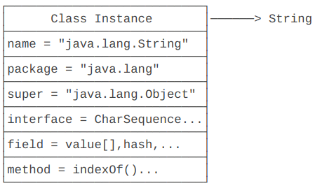

# 反射

Reflection，指程序在运行期可以获取一个对象的所有信息，而无需在程序编写时认知并导入相应的类

## Class 类

除了 `int` 等基本类型外，Java 的其他类型全部都是 `class` ( 包括 `interface`)。例如：

- `String`
- `Object`
- `Runnable`
- `Exception`
- ...

`class` 的本质是数据类型（`Type`）。无继承关系的数据类型无法赋值

JVM 在第一次读取到一种 `class` 类型时，将其加载进内存。每家在一种 `class` ，JVM 就为其创建一个 `Class` 类型的实例，并关联起来。

```java
public final class Class {
    private Class() {}
}
```

以 `String` 类为例，当 JVM 加载 `String` 类时，它首先读取 `String.class` 文件到内存，然后为 `String` 类创建一个 `Class` 实例并关联起来：

```java
Class cls = new Class(String)
```

这个 `Class` 实例是 JVM 内部创建的，其构造方法为 `private` ；

JVM 持有的每个 `Class` 实例都指向一个数据类型（ `class` 或 `interface`）;

一个 `Class` 实例包含了该 `class` 的所有完整信息：



通过 `Class` 实例获取 `class` 信息的方法称为反射（ Reflection）

### 获取 `Class` 实例的三个方法

1. 直接通过一个 `class` 的静态变量 `class` 获取：

   ```java
   // 仍要事先知道相应的类
   Class cls = String.class;
   ```

2. 通过实例变量的 `getClass()` 方法获取：

   ```java
   String s = "Hello";
   Class cls = s.getClass();
   ```

3. 知道一个 `class` 的完整类名，通过静态方法 `Class.forName()` 获取：

   ```java
   Class cls = Class.forName("java.lang.String");
   ```

上述方法获取的 `Class` 实例是同一个实例，可直接用 `==` 比较

### 局限

数组如 `String[]` 也是一种 `Class` 且其类名为 `[Ljava.lang.String` ；

基本类型如 `int` 也有 `int.class` 获取其 `Class` 实例；

```java
Class cls = String.class;
String s = (Stirng) cls.newInstance();
```

上述代码相当于 `new String()` ，此方法只能调用 `public` 的无参构造方法。

### 动态加载

JVM 在执行 Java 程序时，只有当需要该 Class 时才加载入内存，若未调用则即使写进程序也不会加载（节约空间）

## 访问字段

由 `Class` 实例获取字段信息：

- Field getField(name): 根据字段名获取某个 public 的 field（包括父类）
- Field getDeclaredField(name): 根据字段名获取当前类的某个 field（不包括父类）
- Field[] getFields(): 获取所有 public 的 field（包括父类）
- Field[] getDeclaredFields(): 获取当前类的所有 field（不包括父类）

以上方法获得了 `Field` 对象，其包含一个字段的所有信息：

- `getName()`: 返回字段名称，例如，`"name"`；
- `getType()`: 返回字段类型，也是一个 `Class` 实例，例如，`String.class`；
- `getModifiers()`: 返回字段的修饰符，它是一个 `int` ，不同的 bit 表示不同的含义

### 获取字段值

`Field` 实例的 `get(Object)`  方法获取指定实例的指定字段的值

默认不能访问 `private` 字段，需要修改修饰符或者在调用 `get()` 之前

```java
f.setAccessible(true);
```

如果 JVM 运行期存在 `SecurityManager` ，则可能根据规则进行检查并阻止 `setAccessible(true)`

### 设置字段值

`Field.set(Object, Object)` 给指定实例对象的字段设置值，类似 `get()` 访问 `private` 字段需要先调用 `setAccessible(true)`

## 调用方法

可以通过 `Class` 实例获取所有 `Method` 信息：

- `Method getMethod(name, Class...)` ：获取某个 `public` 的 `Method` (包括父类)
- `Method getDeclaredMethod(name, Class...)` ：获取当前类的某个 `Method` （不包括父类）
- `Method[] getMethods()` ：获取所有 `public` 的 `Method` （包括父类）
- `Method[] getDeclaredMethods()` ：获取当前类的所有 `Method` （不包括父类）

前两个方法的 `Class...` 表示所需入参的 `Class` ，需要传入 0+ 个，对应不同的方法重载

一个 `Method` 对象包含一个方法的所有信息：

- `getName()` ：返回方法名称
- `getReturnType()` ：返回方法返回值类型，也是一个 `Class` 实例
- `getParameterTypes()` ：返回方法的参数类型，是一个 `Class` 数组，例如 `{String.class, int.class}`
- `getModifiers()` ：返回方法的修饰符为 `int` 表示不同含义

### 调用方法

获取到 `Method` 对象后调用 `invoke(Obj, args...)` 方法来进行对象方法调用

```java
public class Main {
    public static void main(String[] args) throws Exception {
        // String对象:
        String s = "Hello world";
        // 获取String substring(int)方法，参数为int:
        Method m = String.class.getMethod("substring", int.class);
        // 在s对象上调用该方法并获取结果:
        String r = (String) m.invoke(s, 6);
        // 打印调用结果:
        System.out.println(r);
    }
}
```

`invoke` 的第一个参数时对象实例，后面的可变参数与获取的 `Method` 对象的参数一致

### 调用静态方法

使用同上，但传入的第一个参数永远为 `null` （静态方法属于类，无需对象）

### 调用非 public 方法

类似**访问** `Field` 时的问题，在**调用**非 `public` 的方法时会得到 `IllegalAccessException` ，想要避免需要在之前 `Method.setAccessible(true)` 允许

### 多态

使用反射调用方法时，遵循**多态原则**：总是调用实际类型的覆写方法（如果存在）

### 小结

Java的反射API提供的Method对象封装了方法的所有信息：

通过 `Class` 实例的方法可以获取 `Method` 实例：`getMethod()`，`getMethods()`，`getDeclaredMethod()`，`getDeclaredMethods()`；

通过 `Method` 实例可以获取方法信息：`getName()`，`getReturnType()`，`getParameterTypes()`，`getModifiers()`；

通过 `Method` 实例可以调用某个对象的方法：`Object invoke(Object instance, Object... parameters)`；

通过设置 `setAccessible(true)` 来访问非 `public` 方法；

通过反射调用方法时，仍然遵循多态原则。

## 调用构造方法

Java 的反射 API 提供了 Constructor 对象，类似 Method 并在调用时返回实例

通过 Class 实例获取 Constructor 的方法如下：

- `getConstructor(Class...)` ：获取某个 `public` 的 `Constructor`
- `getDeclaredConstructor(Class...)` ：获取某个 `Constructor`
- `getConstructors()` ：获取所有 `public` 的 `Constructor`
- `getDeclaredConstructors()` ：获取所有 `Constructor`

注意 `Constructor` 总是当前类定义的构造方法，和父类无关，不存在多态的问题

调用非 `public` 问题同上

### 小结

`Constructor` 对象封装了构造方法的所有信息；

通过Class实例的方法可以获取 `Constructor` 实例：`getConstructor()`，`getConstructors()`，`getDeclaredConstructor()`，`getDeclaredConstructors()`；

通过 `Constructor` 实例可以创建一个实例对象：`newInstance(Object... parameters)`； 通过设置 `setAccessible(true)` 来访问非 `public` 构造方法。

## 获取继承关系

### 获取父类的 Class

`Class` 对象的 `getSuperclass()` 方法获取父类（唯一）

### 获取 interface

`getInterfaces()` 返回一个 `Class[]` 表示所有的接口

注意：其只返回当前类直接实现的接口类型，并不包括其父类实现的接口类型

同时获取接口的父接口也只能用 `getInterfaces()`，用 `getSuperclass()`会返回 `null`

若没有实现任何接口则返回空数组

### 继承关系

对两个 `Class` 实例可以调用 `isAssignableFrom()` 判断是否能由后者给前者赋值（前者是否后者的父类）

## 动态代理（ Dynamic Proxy）

所有 `interface` 类型的变量总是通过某个实例向上转型并赋值给接口类型变量

```java
CharSequence cs = new StringBuilder();
```

动态代理则是在运行期动态创建某个 `interface` 的实例

```java
import java.lang.reflect.InvocationHandler;
import java.lang.reflect.Method;
import java.lang.reflect.Proxy;

public class Main {
    public static void main(String[] args) {
        InvocationHandler handler = new InvocationHandler() {
            @Override
            public Object invoke(Object proxy, Method method, Object[] args) throws Throwable {
                System.out.println(method);
                if (method.getName().equals("morning")) {
                    System.out.println("Good morning, " + args[0]);
                }
                return null;
            }
        };
        Hello hello = (Hello) Proxy.newProxyInstance(
            Hello.class.getClassLoader(), // 传入ClassLoader
            new Class[] { Hello.class }, // 传入要实现的接口
            handler); // 传入处理调用方法的InvocationHandler
        hello.morning("Bob");
    }
}

interface Hello {
    void morning(String name);
}
```

动态创建 `interface` 实例方法如下：

1. 定义一个 `InvocationHandler` 实例，它负责实现接口的方法调用
2. 通过 `Proxy.newProxyInstance()` 创建 `interface` 实例，它需要三个参数：
   1. 使用的 `ClassLoader` ，通常就是接口类的 `ClassLoader`
   2. 需要实现的接口数组，至少需要传入一个接口
   3. 用来处理接口方法调用的 `InvocationHandler` 实例
3. 将返回的 `Object` 强制转型为接口

对应静态代理

```java
public class HelloDynamicProxy implements Hello {
    InvocationHandler handler;
    public HelloDynamicProxy(InvocationHandler handler) {
        this.handler = handler;
    }
    public void morning(String name) {
        handler.invoke(
           this,
           Hello.class.getMethod("morning", String.class),
           new Object[] { name });
    }
}
```

动态代理中用 `InvocationHandler` 对象来覆写一些方法，后续创建 `interface` 实例时定义但未编写的方法就遵从上述编写