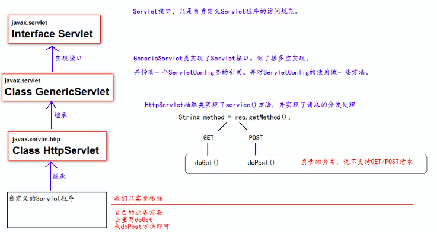

# Servlet

## 什么是 Servlet

1. Servlet 是 JavaEE 规范之一。规范就是接口
2. Servlet 是 JavaWeb 三大组件之一。三大组件分别是：Servlet 程序、Filter 过滤器、Listener 监听器
3. Servlet 是运行在服务器上的一个 java 程序，它可以**接受客户端发送过来的请求，并响应数据给客户端**

## 实现流程

1. 编写一个类去实现 Servlet 接口
2. 实现 service 方法，处理请求，并响应数据
3. 到 web.xml 中去配置 servlet 程序的访问地址

## 生命周期

1. 执行 Servlet 构造方法
2. 执行 init 初始化方法
第一、二步是在第一次访问的时候创建 servlet 程序会被调用
3. 执行 service 方法
第三步是在每次访问都会调用
4. 执行 destory 销毁方法
第四步是在 web 工程停止的时候会调用

## 主要方法

```java
public void service(ServletRequest servletRequest, ServletResponse servletResponse) throws ServletException, IOException
```

其中 ServletRequest 的子类 HttpServletRequest 带有方法 getMethod() 来获取请求类型


## 通过继承 HttpServlet 实现 Servlet 程序

一般在实际项目开发中都是使用继承 HttpServlet 类的方法去实现 Servlet 程序

1. 编写一个类去继承 HttpServlet 类
2. 根据业务需要重写 doGet 或 doPost 方法
3. 到 web.xml 中配置 Servlet 程序的访问地址

也可直接在包上右击 -> new Servlet -> 创建后再补充一点即可



## ServletConfig 类

Servlet 程序的配置信息类，有三大作用：

1. 获取 Servlet 程序的别名 servlet-name 的值
2. 获取初始化参数 init-param
3. 获取 ServletContext 对象

Servlet 程序和 SetvletConfig 对象都是由 Tomcat 负责创建

重写 init() 方法必须注意调用 super.init() 再实现自己的新功能

## ServletContext 类

1. ServletContext 是一个接口，它表示 Servlet 上下文对象
2. 一个 web 工程，**只有一个** servletcontext 对象实例
3. 是一个域对象
4. 在 web 工程部署启动的时候创建，在 web 工程停止的时候销毁
   1. 例如 restart 会把过程中的新增或修改数据还原

域对象是可以像 Map 一样存取数据的对象

|        | 存数据         | 取数据         | 删除数据          |
| ------ | -------------- | -------------- | ----------------- |
| Map    | put()          | get()          | remove()          |
| 域对象 | setAttribute() | getAttribute() | removeAttribute() |

### 四个作用

1. 获取 web.xml 中配置的上下文参数 context-param
2. 获取当前的工程路径，格式“/工程路径”
3. 获取工程部署后在服务器硬盘上的绝对路径
4. 像 Map 一样存取数据
