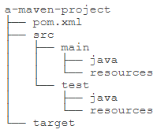
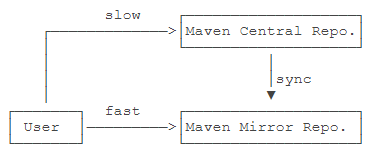

# yosoro~

## Maven

​	Maven 翻译为"专家"、"内行"，是 

[^Apache]: yyds

 下的一个纯 Java 开发的开源项目。基于项目对象模型（POM）概念，Maven 是一个 Java 项目管理的构建工具，可以定义项目结构、项目依赖，并使用统一的方式进行自动化构建，是 Java 项目不可缺少的工具。

功能：构建、文档生成、报告、依赖、SCMs、发布、分发、邮件列表

### 约定配置

一个公共的标准目录结构

| 目录                               | 目的                                                         |
| :--------------------------------- | :----------------------------------------------------------- |
| ${basedir}                         | 存放pom.xml和所有的子目录                                    |
| ${basedir}/src/main/java           | 项目的java源代码                                             |
| ${basedir}/src/main/resources      | 项目的资源，比如说property文件，springmvc.xml                |
| ${basedir}/src/test/java           | 项目的测试类，比如说Junit代码                                |
| ${basedir}/src/test/resources      | 测试用的资源                                                 |
| ${basedir}/src/main/webapp/WEB-INF | web应用文件目录，web项目的信息，比如存放web.xml、本地图片、jsp视图页面 |
| ${basedir}/target                  | 打包输出目录                                                 |
| ${basedir}/target/classes          | 编译输出目录                                                 |
| ${basedir}/target/test-classes     | 测试编译输出目录                                             |
| Test.java                          | Maven只会自动运行符合该命名规则的测试类                      |
| ~/.m2/repository                   | Maven默认的本地仓库目录位置                                  |

### Maven 介绍

先来看看一个Java项目需要的东西。首先，我们需要确定引入哪些依赖包。例如，如果我们需要用到[commons logging](https://commons.apache.org/proper/commons-logging/)，我们就必须把commons logging的jar包放入classpath。如果我们还需要[log4j](https://logging.apache.org/log4j/)，就需要把log4j相关的jar包都放到classpath中。这些就是**依赖包的管理**。

其次，我们要确定项目的目录结构。例如，`src`目录存放Java源码，`resources`目录存放配置文件，`bin`目录存放编译生成的`.class`文件。

此外，我们还需要配置环境，例如JDK的版本，编译打包的流程，当前代码的版本号。

最后，除了使用Eclipse这样的IDE进行编译外，我们还必须能通过命令行工具进行编译，才能够让项目在一个独立的服务器上编译、测试、部署。

Maven就是是专门为Java项目打造的管理和构建工具，它的主要功能有：

- 提供了一套标准化的项目结构；
- 提供了一套标准化的构建流程（编译，测试，打包，发布……）；
- 提供了一套依赖管理机制。

#### Maven 项目结构



项目的根目录`a-maven-project`是项目名，它有一个项目描述文件`pom.xml`，存放Java源码的目录是`src/main/java`，存放资源文件的目录是`src/main/resources`，存放测试源码的目录是`src/test/java`，存放测试资源的目录是`src/test/resources`，最后，所有编译、打包生成的文件都放在`target`目录里。这些就是一个Maven项目的标准目录结构。

所有的目录结构都是约定好的标准结构，我们千万不要随意修改目录结构。使用标准结构不需要做任何配置，Maven就可以正常使用。

我们再来看最关键的一个项目描述文件`pom.xml`，它的内容长得像下面：

```xml
<project ...>
	<modelVersion>4.0.0</modelVersion>
	<groupId>com.itranswarp.learnjava</groupId>
	<artifactId>hello</artifactId>
	<version>1.0</version>
	<packaging>jar</packaging>
	<properties>
        ...
	</properties>
	<dependencies>
        <dependency>
            <groupId>commons-logging</groupId>
            <artifactId>commons-logging</artifactId>
            <version>1.2</version>
        </dependency>
	</dependencies>
</project>
```

其中，`groupId`类似于Java的包名，通常是公司或组织名称，`artifactId`类似于Java的类名，通常是项目名称，再加上`version`，一个Maven工程就是由`groupId`，`artifactId`和`version`作为唯一标识。我们在引用其他第三方库的时候，也是通过这3个变量确定。例如，依赖`commons-logging`：

```xml
<dependency>
    <groupId>commons-logging</groupId>
    <artifactId>commons-logging</artifactId>
    <version>1.2</version>
</dependency>
```

使用`<dependency>`声明一个依赖后，Maven就会自动下载这个依赖包并把它放到classpath中。

### 依赖管理

Maven的第一个作用就是解决依赖管理。我们声明了自己的项目需要`abc`，Maven会自动导入`abc`的jar包，再判断出`abc`需要`xyz`，又会自动导入`xyz`的jar包，这样，最终我们的项目会依赖`abc`和`xyz`两个jar包。

```xml
<dependency>
    <groupId>org.springframework.boot</groupId>
    <artifactId>spring-boot-starter-web</artifactId>
    <version>1.4.2.RELEASE</version>
</dependency>
```

当我们声明一个`spring-boot-starter-web`依赖时，Maven会自动解析并判断最终需要大概二三十个其他依赖：

```ascii
spring-boot-starter-web
  spring-boot-starter
    spring-boot
    sprint-boot-autoconfigure
    spring-boot-starter-logging
      logback-classic
        logback-core
        slf4j-api
      jcl-over-slf4j
        slf4j-api
      jul-to-slf4j
        slf4j-api
      log4j-over-slf4j
        slf4j-api
    spring-core
    snakeyaml
  spring-boot-starter-tomcat
    tomcat-embed-core
    tomcat-embed-el
    tomcat-embed-websocket
      tomcat-embed-core
  jackson-databind
  ...
```

#### 依赖关系

Maven定义了几种依赖关系，分别是`compile`、`test`、`runtime`和`provided`：

| scope    | 说明                                          | 示例            |
| :------- | :-------------------------------------------- | :-------------- |
| compile  | 编译时需要用到该jar包（默认）                 | commons-logging |
| test     | 编译Test时需要用到该jar包                     | junit           |
| runtime  | 编译时不需要，但运行时需要用到                | mysql           |
| provided | 编译时需要用到，但运行时由JDK或某个服务器提供 | servlet-api     |

其中，默认的`compile`是最常用的，Maven会把这种类型的依赖直接放入classpath。

`test`依赖表示仅在测试时使用，正常运行时并不需要。最常用的`test`依赖就是JUnit：

```xml
<dependency>
    <groupId>org.junit.jupiter</groupId>
    <artifactId>junit-jupiter-api</artifactId>
    <version>5.3.2</version>
    <scope>test</scope>
</dependency>
```

`runtime`依赖表示编译时不需要，但运行时需要。最典型的`runtime`依赖是JDBC驱动，例如MySQL驱动：

```
<dependency>
    <groupId>mysql</groupId>
    <artifactId>mysql-connector-java</artifactId>
    <version>5.1.48</version>
    <scope>runtime</scope>
</dependency>
```

`provided`依赖表示编译时需要，但运行时不需要。最典型的`provided`依赖是Servlet API，编译的时候需要，但是运行时，Servlet服务器内置了相关的jar，所以运行期不需要：

```xml
<dependency>
    <groupId>javax.servlet</groupId>
    <artifactId>javax.servlet-api</artifactId>
    <version>4.0.0</version>
    <scope>provided</scope>
</dependency>
```

Maven维护了一个中央仓库（[repo1.maven.org](https://repo1.maven.org/)），也可以自行添加或替换镜像仓库，所有第三方库将自身的jar以及相关信息上传至中央仓库，Maven就可以从中央仓库把所需依赖下载到本地。

Maven并不会每次都从中央仓库下载jar包。一个jar包一旦被下载过，就会被Maven自动缓存在本地目录（用户主目录的`.m2`目录），所以，除了第一次编译时因为下载需要时间会比较慢，后续过程因为有本地缓存，并不会重复下载相同的jar包。

#### 唯一 ID

对于某个依赖，Maven只需要3个变量即可唯一确定某个jar包：

- groupId：属于组织的名称，类似Java的包名；
- artifactId：该jar包自身的名称，类似Java的类名；
- version：该jar包的版本。

通过上述3个变量，即可唯一确定某个jar包。Maven通过对jar包进行PGP签名确保任何一个jar包一经发布就无法修改。修改已发布jar包的唯一方法是发布一个新版本。

因此，某个jar包一旦被Maven下载过，即可永久地安全缓存在本地。

注：只有以`-SNAPSHOT`结尾的版本号会被Maven视为开发版本，开发版本每次都会重复下载，这种SNAPSHOT版本只能用于内部私有的Maven repo，公开发布的版本不允许出现SNAPSHOT。

#### Maven 镜像

除了可以从Maven的中央仓库下载外，还可以从Maven的镜像仓库下载。如果访问Maven的中央仓库非常慢，我们可以选择一个速度较快的Maven的镜像仓库。Maven镜像仓库定期从中央仓库同步：



中国区用户可以使用阿里云提供的Maven镜像仓库。使用Maven镜像仓库需要一个配置，在用户主目录下进入`.m2`目录，创建一个`settings.xml`配置文件，内容如下：

```xml
<settings>
    <mirrors>
        <mirror>
            <id>aliyun</id>
            <name>aliyun</name>
            <mirrorOf>central</mirrorOf>
            <!-- 国内推荐阿里云的Maven镜像 -->
            <url>https://maven.aliyun.com/repository/central</url>
        </mirror>
    </mirrors>
</settings>
```

#### 搜索第三方组件

如果我们要引用一个第三方组件，比如`okhttp`，如何确切地获得它的`groupId`、`artifactId`和`version`？方法是通过[search.maven.org](https://search.maven.org/)搜索关键字，找到对应的组件后，直接复制：

#### 命令行编译

在 `pom.xml` 所在目录输入以下命令：

```shell
$ mvn clean package
```

如果一切顺利，即可在`target`目录下获得编译后自动打包的jar。

#### 在 IDE 中使用 Maven

几乎所有的IDE都内置了对Maven的支持。在Eclipse中，可以直接创建或导入Maven项目。如果导入后的Maven项目有错误，可以尝试选择项目后点击右键，选择Maven - Update Project...更新：

### 构建流程

Maven不但有标准化的项目结构，而且还有一套标准化的构建流程，可以自动化实现编译，打包，发布，等等。

#### Lifecycle 和 Phase

首先要了解什么是Maven的生命周期（lifecycle）。

Maven的生命周期由一系列阶段（phase）构成，以内置的生命周期`default`为例，它包含以下phase：

- validate
- initialize
- generate-sources
- process-sources
- generate-resources
- process-resources
- **compile**
- process-classes
- generate-test-sources
- process-test-sources
- generate-test-resources
- process-test-resources
- test-compile
- process-test-classes
- test
- prepare-package
- **package**
- pre-integration-test
- integration-test
- post-integration-test
- verify
- install
- deploy

------

如果我们运行`mvn package`，Maven就会执行`default`生命周期，它会从开始一直运行到`package`这个phase为止：

- validate
- ...
- package

如果我们运行`mvn compile`，Maven也会执行`default`生命周期，但这次它只会运行到`compile`，即以下几个phase：

- validate
- ...
- compile

----

Maven另一个常用的生命周期是`clean`，它会执行3个phase：

- pre-clean
- clean （注意这个clean不是lifecycle而是phase）
- post-clean

所以，我们使用`mvn`这个命令时，后面的参数是phase，Maven自动根据生命周期运行到指定的phase。

--------

更复杂的例子是指定多个phase，例如，运行`mvn clean package`，Maven先执行`clean`生命周期并运行到`clean`这个phase，然后执行`default`生命周期并运行到`package`这个phase，实际执行的phase如下：

- pre-clean
- clean （注意这个clean是phase）
- validate
- ...
- package

-------------

在实际开发过程中，经常使用的命令有：

`mvn clean`：清理所有生成的class和jar；

`mvn clean compile`：先清理，再执行到`compile`；

`mvn clean test`：先清理，再执行到`test`，因为执行`test`前必须执行`compile`，所以这里不必指定`compile`；

`mvn clean package`：先清理，再执行到`package`。

大多数phase在执行过程中，因为我们通常没有在`pom.xml`中配置相关的设置，所以这些phase什么事情都不做。

经常用到的phase其实只有几个：

- clean：清理
- compile：编译
- test：运行测试
- package：打包

#### Goal

执行一个phase又会触发一个或多个goal，goal 是最小任务单元：

| 执行的Phase | 对应执行的Goal                     |
| :---------- | :--------------------------------- |
| compile     | compiler:compile                   |
| test        | compiler:testCompile surefire:test |

goal的命名总是`abc:xyz`这种形式。

- lifecycle相当于Java的package，它包含一个或多个phase；
- phase相当于Java的class，它包含一个或多个goal；
- goal相当于class的method，它其实才是真正干活的。

大多数情况，我们只要指定phase，就默认执行这些phase默认绑定的goal，只有少数情况，我们可以直接指定运行一个goal，例如，启动Tomcat服务器：

```shell
mvn tomcat:run
```

#### 使用插件

我们以`compile`这个phase为例，如果执行：

```shell
mvn compile
```

Maven将执行`compile`这个phase，这个phase会调用`compiler`插件执行关联的`compiler:compile`这个goal。

实际上，执行每个phase，都是通过某个插件（plugin）来执行的，Maven本身其实并不知道如何执行`compile`，它只是负责找到对应的`compiler`插件，然后执行默认的`compiler:compile`这个goal来完成编译。

所以，使用Maven，实际上就是配置好需要使用的插件，然后通过phase调用它们。

Maven已经内置了一些常用的标准插件：

| 插件名称 | 对应执行的phase |
| :------- | :-------------- |
| clean    | clean           |
| compiler | compile         |
| surefire | test            |
| jar      | package         |

如果标准插件无法满足需求，我们还可以使用自定义插件。使用自定义插件的时候，需要声明。例如，使用`maven-shade-plugin`可以创建一个可执行的jar，要使用这个插件，需要在`pom.xml`中声明它：

```xml
<project>
    ...
	<build>
		<plugins>
			<plugin>
				<groupId>org.apache.maven.plugins</groupId>
				<artifactId>maven-shade-plugin</artifactId>
                <version>3.2.1</version>
				<executions>
					<execution>
						<phase>package</phase>
						<goals>
							<goal>shade</goal>
						</goals>
						<configuration>
                            ...
						</configuration>
					</execution>
				</executions>
			</plugin>
		</plugins>
	</build>
</project>
```

自定义插件往往需要一些配置，例如，`maven-shade-plugin`需要指定Java程序的入口，它的配置是：

```xml
<configuration>
    <transformers>
        <transformer implementation="org.apache.maven.plugins.shade.resource.ManifestResourceTransformer">
            <mainClass>com.itranswarp.learnjava.Main</mainClass>
        </transformer>
    </transformers>
</configuration>
```

注意，Maven自带的标准插件例如`compiler`是无需声明的，只有引入其它的插件才需要声明。

下面列举了一些常用的插件：

- maven-shade-plugin：打包所有依赖包并生成可执行jar；
- cobertura-maven-plugin：生成单元测试覆盖率报告；
- findbugs-maven-plugin：对Java源码进行静态分析以找出潜在问题。

#### 模块管理

对于Maven工程来说，原来是一个大项目：

```ascii
single-project
├── pom.xml
└── src
```

现在可以分拆成3个模块：

```ascii
mutiple-project
├── module-a
│   ├── pom.xml
│   └── src
├── module-b
│   ├── pom.xml
│   └── src
└── module-c
    ├── pom.xml
    └── src
```

Maven可以有效地管理多个模块，我们只需要把每个模块当作一个独立的Maven项目，它们有各自独立的`pom.xml`。例如，模块A的`pom.xml`：

```xml
<project xmlns="http://maven.apache.org/POM/4.0.0"
    xmlns:xsi="http://www.w3.org/2001/XMLSchema-instance"
    xsi:schemaLocation="http://maven.apache.org/POM/4.0.0 http://maven.apache.org/xsd/maven-4.0.0.xsd">
    <modelVersion>4.0.0</modelVersion>

    <groupId>com.itranswarp.learnjava</groupId>
    <artifactId>module-a</artifactId>
    <version>1.0</version>
    <packaging>jar</packaging>

    <name>module-a</name>

    <properties>
        <project.build.sourceEncoding>UTF-8</project.build.sourceEncoding>
        <project.reporting.outputEncoding>UTF-8</project.reporting.outputEncoding>
        <maven.compiler.source>11</maven.compiler.source>
        <maven.compiler.target>11</maven.compiler.target>
        <java.version>11</java.version>
    </properties>

    <dependencies>
        <dependency>
            <groupId>org.slf4j</groupId>
            <artifactId>slf4j-api</artifactId>
            <version>1.7.28</version>
        </dependency>
        <dependency>
            <groupId>ch.qos.logback</groupId>
            <artifactId>logback-classic</artifactId>
            <version>1.2.3</version>
            <scope>runtime</scope>
        </dependency>
        <dependency>
            <groupId>org.junit.jupiter</groupId>
            <artifactId>junit-jupiter-engine</artifactId>
            <version>5.5.2</version>
            <scope>test</scope>
        </dependency>
    </dependencies>
</project>
```

模块B的`pom.xml`：

```xml
<project xmlns="http://maven.apache.org/POM/4.0.0"
    xmlns:xsi="http://www.w3.org/2001/XMLSchema-instance"
    xsi:schemaLocation="http://maven.apache.org/POM/4.0.0 http://maven.apache.org/xsd/maven-4.0.0.xsd">
    <modelVersion>4.0.0</modelVersion>

    <groupId>com.itranswarp.learnjava</groupId>
    <artifactId>module-b</artifactId>
    <version>1.0</version>
    <packaging>jar</packaging>

    <name>module-b</name>

    <properties>
        <project.build.sourceEncoding>UTF-8</project.build.sourceEncoding>
        <project.reporting.outputEncoding>UTF-8</project.reporting.outputEncoding>
        <maven.compiler.source>11</maven.compiler.source>
        <maven.compiler.target>11</maven.compiler.target>
        <java.version>11</java.version>
    </properties>

    <dependencies>
        <dependency>
            <groupId>org.slf4j</groupId>
            <artifactId>slf4j-api</artifactId>
            <version>1.7.28</version>
        </dependency>
        <dependency>
            <groupId>ch.qos.logback</groupId>
            <artifactId>logback-classic</artifactId>
            <version>1.2.3</version>
            <scope>runtime</scope>
        </dependency>
        <dependency>
            <groupId>org.junit.jupiter</groupId>
            <artifactId>junit-jupiter-engine</artifactId>
            <version>5.5.2</version>
            <scope>test</scope>
        </dependency>
    </dependencies>
</project>
```

可以看出来，模块A和模块B的`pom.xml`高度相似，因此，我们可以提取出共同部分作为`parent`：

```xml
<project xmlns="http://maven.apache.org/POM/4.0.0"
    xmlns:xsi="http://www.w3.org/2001/XMLSchema-instance"
    xsi:schemaLocation="http://maven.apache.org/POM/4.0.0 http://maven.apache.org/xsd/maven-4.0.0.xsd">
    <modelVersion>4.0.0</modelVersion>

    <groupId>com.itranswarp.learnjava</groupId>
    <artifactId>parent</artifactId>
    <version>1.0</version>
    <packaging>pom</packaging>

    <name>parent</name>

    <properties>
        <project.build.sourceEncoding>UTF-8</project.build.sourceEncoding>
        <project.reporting.outputEncoding>UTF-8</project.reporting.outputEncoding>
        <maven.compiler.source>11</maven.compiler.source>
        <maven.compiler.target>11</maven.compiler.target>
        <java.version>11</java.version>
    </properties>

    <dependencies>
        <dependency>
            <groupId>org.slf4j</groupId>
            <artifactId>slf4j-api</artifactId>
            <version>1.7.28</version>
        </dependency>
        <dependency>
            <groupId>ch.qos.logback</groupId>
            <artifactId>logback-classic</artifactId>
            <version>1.2.3</version>
            <scope>runtime</scope>
        </dependency>
        <dependency>
            <groupId>org.junit.jupiter</groupId>
            <artifactId>junit-jupiter-engine</artifactId>
            <version>5.5.2</version>
            <scope>test</scope>
        </dependency>
    </dependencies>
</project>
```

注意到parent的`<packaging>`是`pom`而不是`jar`，因为`parent`本身不含任何Java代码。编写`parent`的`pom.xml`只是为了在各个模块中减少重复的配置。现在我们的整个工程结构如下：

```ascii
multiple-project
├── pom.xml
├── parent
│   └── pom.xml
├── module-a
│   ├── pom.xml
│   └── src
├── module-b
│   ├── pom.xml
│   └── src
└── module-c
    ├── pom.xml
    └── src
```

这样模块A就可以简化为：

```
<project xmlns="http://maven.apache.org/POM/4.0.0"
    xmlns:xsi="http://www.w3.org/2001/XMLSchema-instance"
    xsi:schemaLocation="http://maven.apache.org/POM/4.0.0 http://maven.apache.org/xsd/maven-4.0.0.xsd">
    <modelVersion>4.0.0</modelVersion>

    <parent>
        <groupId>com.itranswarp.learnjava</groupId>
        <artifactId>parent</artifactId>
        <version>1.0</version>
        <relativePath>../parent/pom.xml</relativePath>
    </parent>

    <artifactId>module-a</artifactId>
    <packaging>jar</packaging>
    <name>module-a</name>
</project>
```

模块B、模块C都可以直接从`parent`继承，大幅简化了`pom.xml`的编写。

如果模块A依赖模块B，则模块A需要模块B的jar包才能正常编译，我们需要在模块A中引入模块B：

```
    ...
    <dependencies>
        <dependency>
            <groupId>com.itranswarp.learnjava</groupId>
            <artifactId>module-b</artifactId>
            <version>1.0</version>
        </dependency>
    </dependencies>
```

最后，在编译的时候，需要在根目录创建一个`pom.xml`统一编译：

```
<project xmlns="http://maven.apache.org/POM/4.0.0"
    xmlns:xsi="http://www.w3.org/2001/XMLSchema-instance"
    xsi:schemaLocation="http://maven.apache.org/POM/4.0.0 http://maven.apache.org/maven-v4_0_0.xsd">

    <modelVersion>4.0.0</modelVersion>
    <groupId>com.itranswarp.learnjava</groupId>
    <artifactId>build</artifactId>
    <version>1.0</version>
    <packaging>pom</packaging>
    <name>build</name>

    <modules>
        <module>parent</module>
        <module>module-a</module>
        <module>module-b</module>
        <module>module-c</module>
    </modules>
</project>
```

这样，在根目录执行`mvn clean package`时，Maven根据根目录的`pom.xml`找到包括`parent`在内的共4个`<module>`，一次性全部编译。

#### 中央仓库

其实我们使用的大多数第三方模块都是这个用法，例如，我们使用commons logging、log4j这些第三方模块，就是第三方模块的开发者自己把编译好的jar包发布到Maven的中央仓库中。

#### 私有仓库

私有仓库是指公司内部如果不希望把源码和jar包放到公网上，那么可以搭建私有仓库。私有仓库总是在公司内部使用，它只需要在本地的`~/.m2/settings.xml`中配置好，使用方式和中央仓位没有任何区别。

#### 本地仓库

本地仓库是指把本地开发的项目“发布”在本地，这样其他项目可以通过本地仓库引用它。但是我们不推荐把自己的模块安装到Maven的本地仓库，因为每次修改某个模块的源码，都需要重新安装，非常容易出现版本不一致的情况。更好的方法是使用模块化编译，在编译的时候，告诉Maven几个模块之间存在依赖关系，需要一块编译，Maven就会自动按依赖顺序编译这些模块。

### 使用 mvnw

`mvnw`是Maven Wrapper的缩写。因为我们安装Maven时，默认情况下，系统所有项目都会使用全局安装的这个Maven版本。但是，对于某些项目来说，它可能必须使用某个特定的Maven版本，这个时候，就可以使用Maven Wrapper，它可以负责给这个特定的项目安装指定版本的Maven，而其他项目不受影响。

简单地说，Maven Wrapper就是给一个项目提供一个独立的，指定版本的Maven给它使用。

#### 安装Maven Wrapper

安装Maven Wrapper最简单的方式是在项目的根目录（即`pom.xml`所在的目录）下运行安装命令：

```
mvn -N io.takari:maven:0.7.6:wrapper
```

它会自动使用最新版本的Maven。注意`0.7.6`是Maven Wrapper的版本。最新的Maven Wrapper版本可以去[官方网站](https://github.com/takari/maven-wrapper)查看。

如果要指定使用的Maven版本，使用下面的安装命令指定版本，例如`3.3.3`：

```
mvn -N io.takari:maven:0.7.6:wrapper -Dmaven=3.3.3
```

安装后，查看项目结构：

```ascii
my-project
├── .mvn
│   └── wrapper
│       ├── MavenWrapperDownloader.java
│       ├── maven-wrapper.jar
│       └── maven-wrapper.properties
├── mvnw
├── mvnw.cmd
├── pom.xml
└── src
    ├── main
    │   ├── java
    │   └── resources
    └── test
        ├── java
        └── resources
```

发现多了`mvnw`、`mvnw.cmd`和`.mvn`目录，我们只需要把`mvn`命令改成`mvnw`就可以使用跟项目关联的Maven。例如：

```
mvnw clean package
```

在Linux或macOS下运行时需要加上`./`：

```
./mvnw clean package
```

Maven Wrapper的另一个作用是把项目的`mvnw`、`mvnw.cmd`和`.mvn`提交到版本库中，可以使所有开发人员使用统一的Maven版本。

### 发布 Artifact

略


## [POM ( Project Object Model )](https://www.runoob.com/maven/maven-pom.html)

是 Maven 工程的基本工作单元，是一个 XML 文件，包含了项目的基本信息，用于描述项目如何构建，声明项目依赖，等等。

可指定以下配置：

- 项目依赖
- 插件
- 执行目标
- 项目构建 profile
- 项目版本
- 项目开发者列表
- 相关邮件列表信息

