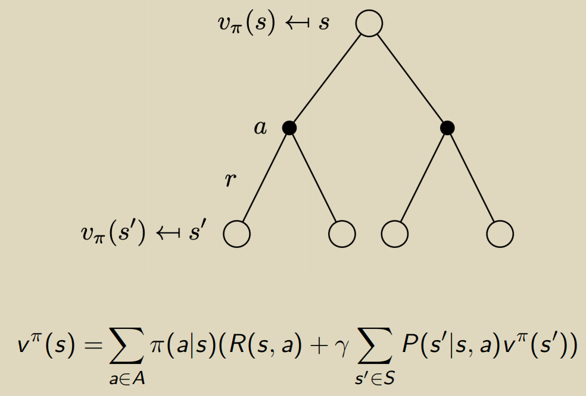
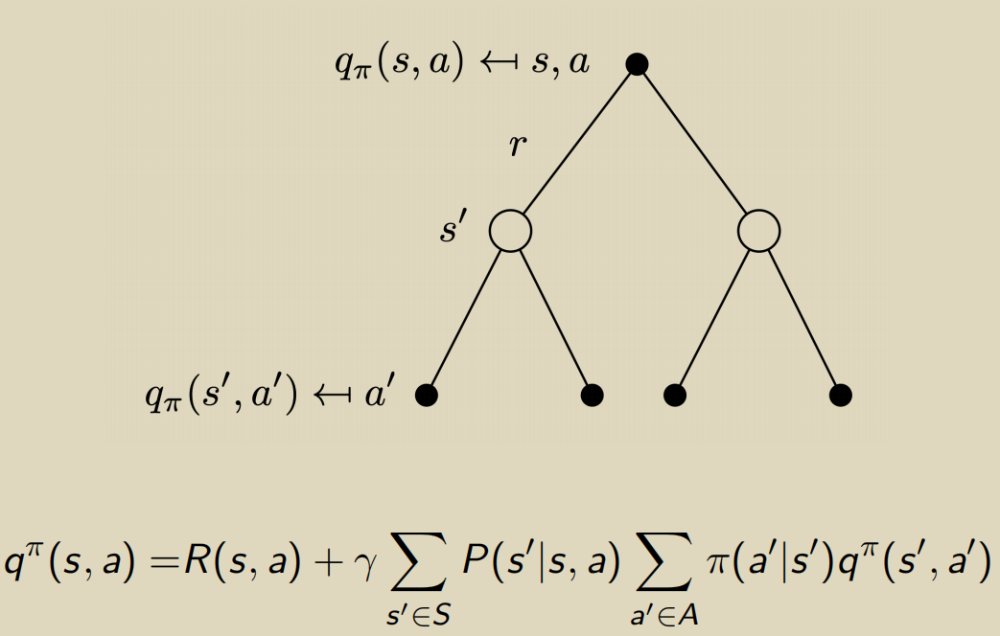

# yosoro~

MDP for Markov Decision Process

## 马尔科夫决策过程

对历史状态数据描述下一刻状态的转移概率
$$
h_t = {s_1, s_2, ... ,s_t}
$$
马尔科夫性质不在此赘述

### Markov Reward Process (MRP)

定义包括：

1. (有限)的状态集合 S

2. 状态转移矩阵 P

3. 奖励函数
   $$
   R(s_t=s)=\mathbb E[r_t|s_t=s]
   $$

4. 一个折扣系数（超参）
   $$
   \gamma \in [0,1]
   $$

此处的奖励仅由该时刻状态确定

### 评价函数

#### Horizon

number of maximum time steps in each episode —— 一个训练周期内的最大转移次数，可以取无穷大考虑其收敛性

#### Return

在未来时间折扣下的当前奖励（**注意是从下一时刻 t+1 开始求和**）
$$
G_t = R_{t+1}+\gamma R_{t+2} + \gamma^2R_{t+3} +...+\gamma^{T-t-1}R_T
$$

#### State Value Function

基于当前状态下的未来奖励的期望
$$
V_t(s)=\mathbb E[G_t|s_t=s]
$$
对于上式的计算求值可以借助一些数学方法：

1. MCMC 采样模拟（显然比较费时）

2. Bellman equation :
   $$
   V(s)=R(s)+\gamma \sum_{s' \in S} P(s'|s)V(s')
   $$

当状态表示为有限的向量时，上等式可写成矩阵式
$$
V=R + \gamma PV
$$
并求解得到 
$$
V = (I-\gamma P)^{-1}R
$$
但矩阵求逆的复杂度有 O(N^3)

3. Temporal-Difference learning（TD 算法）

### MDP

基于 MRP 增加了 action ：
$$
(S, A,P,R,\gamma)
$$

- A 为表示动作的有限集合

- 转移概率矩阵与动作 a 相关
  $$
  P^a = P(s_{t+1}=s'|s_t=s,a_t=a)
  $$

- 奖励函数微调
  $$
  R(s_t=s,a_t=a)=\mathbb E[r_t|s_t=s,a_t=a]
  $$

策略 Policy 表示一个执行概率
$$
\pi (a|s)=P(a_t=a|s_t=s)
$$
当确定一个策略后，即有 状态评价函数
$$
\mathtt v^\pi(s)=\mathbb E_\pi[G_t|s_t=s]
$$
以及新定义的 动作评价函数
$$
q^\pi(s,a)=\mathbb E_\pi[G_t|s_t=s,A_t=a]
$$
使得
$$
\mathtt v^\pi(s) = \sum_{a \in A}\pi(a|s)q^\pi(s,a)
$$
类似地有 Bellman Expectation Equation
$$
v^\pi(s)=\mathbb E_\pi[R_{t+1}+\gamma v^\pi(s_{t+1})|s_t=s]
$$

以及与动作 a 相关的 q 函数

### 问题模型

两种问题可由**动态规划**求解

##### Prediction

给定一个策略 **pi** 评估其 value，通常是评价函数对 t 进行多步运算得到收敛结果作为状态的 value Func

##### Control

给出 MDP 模型，搜索最优策略使得 value 最大化

所有策略下最优的 state-value 函数
$$
v^*(s)=max_\pi v^\pi(s)
$$
相应的最优策略为使该状态 s 下价值最大的策略
$$
\pi^*(s)=argmax_\pi v^\pi(s)
$$

#### Control 问题的两种求解方法

##### Policy Iteration

1. **Evaluate** ：在策略 pi 下计算当前的价值
   $$
   v^\pi
   $$

2. **Improve** ：在计算处价值函数后贪心地执行
   $$
   \pi'=greedy(v^\pi)
   $$

