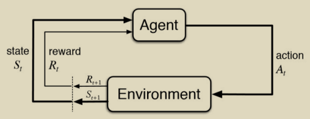
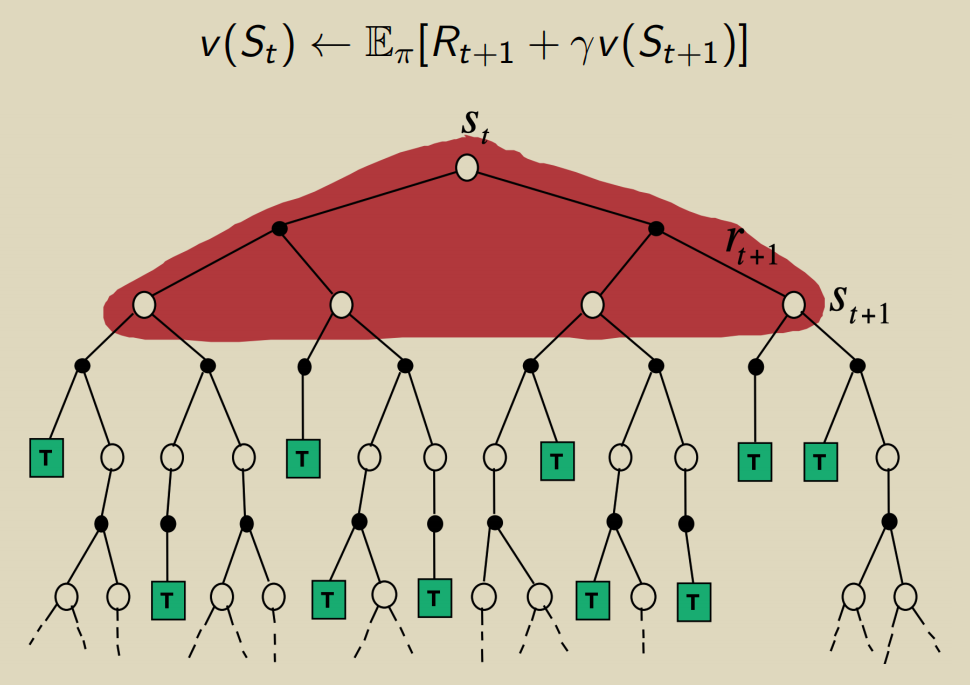
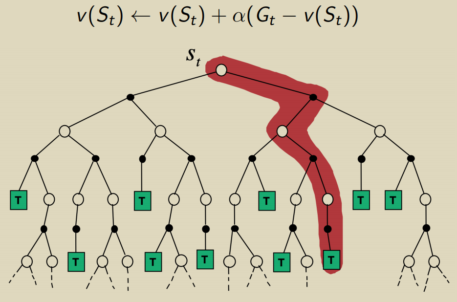
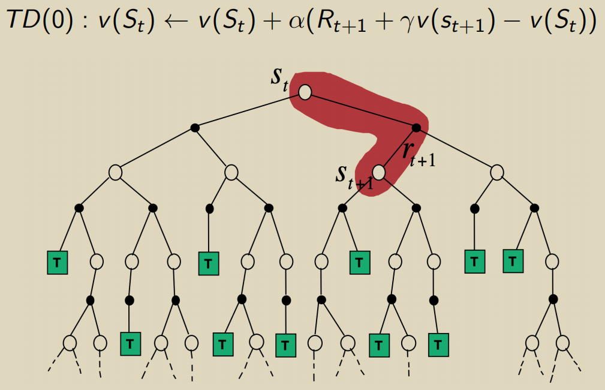
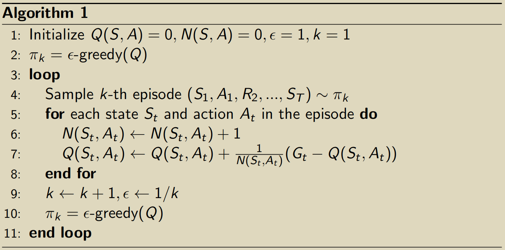
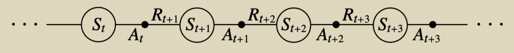
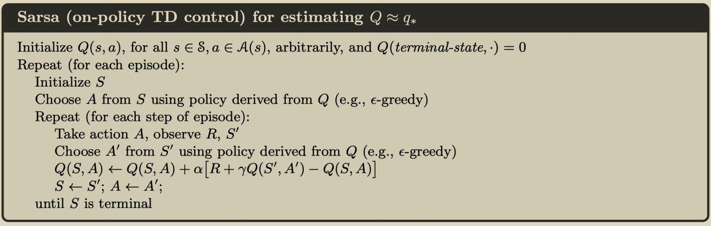
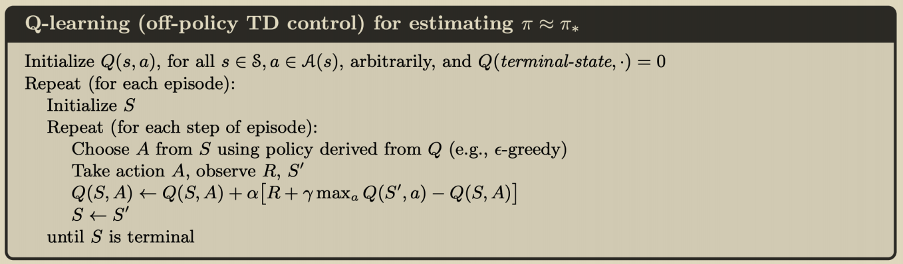

# yosoro~

## [Model-free Prediction and Control](https://github.com/cuhkrlcourse/RLexample/tree/master/modelfree)

预测问题主要评估状态的价值，控制问题主要求解最优的策略来最大化 value function

### Prediction

当奖励 R(s,a) 和转移矩阵 P(s'|s,a) 已知时成 MDP 模型**已知**

但在实际问题中奖励未知或者状态转移过于复杂，无法形成 MDP 模型，由此产生 model-free 的方法，包括：

- 蒙特卡洛策略评估（模拟采样大量轨迹计算其返回值取平均）
- Temporal Difference (TD) learning

智能体执行动作从环境中获得**序列化**的状态和奖励信息反馈

#### Monte-Carlo Policy Evaluation

返回值为一个 episode 的总体结果
$$
G_t=R_{t+1}+\gamma R_{t+2}+\gamma^2R_{t+3} +...
$$

1. 为了估计状态评价函数 v(s)

   1. 每次返回状态 s 构成一个 episode
   2. 计数器 N(s) += 1
   3. 总返回值 S(s) += G_t
   4. 由均值估计 v(s) = S(s) / N(s)

2. 根据大数定律近似地
   $$
   v(s) \rightarrow v^\pi(s) \space as \space N(s) \rightarrow \infty
   $$

其中增量均值 
$$
\mu_t = \frac{1}{t}\sum^t_{j=1}x_j = \frac{1}{t}(x_t+(t-1)\mu_{t-1})=\mu_{t-1}+\frac{1}{t}(x_t-\mu_{t-1})
$$

##### Incremental MC Update 增量 MC 更新

对每一个状态 s_t 随着采集到的一个 episode

1. 采集一个 episode
   $$
   \left(S_{1}, A_{1}, R_{1}, \ldots, S_{t}\right)
   $$

2. 计算每个状态的总体 G_t
   $$
   \begin{aligned}
   &N\left(S_{t}\right) \leftarrow N\left(S_{t}\right)+1 \\
   &v\left(S_{t}\right) \leftarrow v\left(S_{t}\right)+\frac{1}{N\left(S_{t}\right)}\left(G_{t}-v\left(S_{t}\right)\right)
   \end{aligned}
   $$

3. 或者用增量均值直接更新
   $$
   v\left(S_{t}\right) \leftarrow v\left(S_{t}\right)+\alpha\left(G_{t}-v\left(S_{t}\right)\right)
   $$

MC 方法是在实际采样中更新状态的 value 而不是 DP 的求期望方法，因此其计算轻便许多

#### Temporal-Difference (TD) Learning

结合 DP 和 MC 的折中方法，从不完全的 episode 中 bootstrapping 采样学习

最简单的 TD(1) 算法中（ 1 表示向后考虑的步长）：
$$
v\left(S_{t}\right) \leftarrow v\left(S_{t}\right)+\alpha\left(R_{t+1}+\gamma v\left(S_{t+1}\right)-v\left(S_{t}\right)\right)
$$
其中 **TD 目标** 为采样到的后续 n 步的收益
$$
G_{t}^{n}=R_{t+1}+\gamma R_{t+2}+\ldots+\gamma^{n-1} R_{t+n}+\gamma^{n} v\left(S_{t+n}\right)
$$
**TD 误差** 为 TD 目标和当前状态价值的差
$$
\delta_{t}=G_{t}^{n}-v\left(S_{t}\right)
$$

#### 三种方法的比较

DP 方法依照当前策略计算同阶段所有可能状态的期望 value

MC 方法采样完成一个 episode 作为一次增量数据更新 value

TD 方法根据预设的步长采样 bootstrapping 来更新 value

### Control

现有的 **策略迭代** Policy Iteration 算法包括两个步骤循环执行：

1. 给出当前策略 pi 计算状态价值 **Evaluate**
2. 在第一步计算出的价值下贪心地更新策略 **Improve**

为了在 Exploration 和 Exploitation 之间取得平衡，对传统的策略迭代方法给出了一些变化，即 `e-Greedy Exploration` 在策略更新过程中增加了概率值 epsilon ; 在完成第一步后以 e 概率选择随机的动作作为策略，以 1 - e 概率选择贪心的动作作为策略；此概率随着迭代轮次减小
$$
\pi(a \mid s)= \begin{cases}\epsilon /|\mathcal{A}|+1-\epsilon & \text { if } a^{*}=\arg \max _{a \in \mathcal{A}} Q(s, a) \\ \epsilon /|\mathcal{A}| & \text { otherwise }\end{cases}
$$
可以证明此种更新方法是使得 value 单调递增的
$$
\begin{aligned}
q_{\pi}\left(s, \pi^{\prime}(s)\right) &=\sum_{a \in \mathcal{A}} \pi^{\prime}(a \mid s) q_{\pi}(s, a) \\
&=\frac{\epsilon}{|\mathcal{A}|} \sum_{a \in \mathcal{A}} q_{\pi}(s, a)+(1-\epsilon) \max _{a} q_{\pi}(s, a) \\
& \geq \frac{\epsilon}{|\mathcal{A}|} \sum_{a \in \mathcal{A}} q_{\pi}(s, a)+(1-\epsilon) \sum_{a \in \mathcal{A}} \frac{\pi(a \mid s)-\frac{\epsilon}{|\mathcal{A}|}}{1-\epsilon} q_{\pi}(s, a) \\
&=\sum_{a \in \mathcal{A}} \pi(a \mid s) q_{\pi}(s, a)=v_{\pi}(s)
\end{aligned}
$$
算法伪代码如下

在此基础上再采用 TD 学习算法形成下述

#### Sarsa: On-Policy TD Control

由可选的一串状态和动作序列构成一个 episode 

执行一步 e-greedy 策略更新后，**bootstrap** 采样动作价值函数：
$$
Q\left(S_{t}, A_{t}\right) \leftarrow Q\left(S_{t}, A_{t}\right)+\alpha\left[R_{t+1}+\gamma Q\left(S_{t+1}, A_{t+1}\right)-Q\left(S_{t}, A_{t}\right)\right]
$$
此处的 TD target 为
$$
\delta_{t}=R_{t+1}+\gamma Q\left(S_{t+1}, A_{t+1}\right)
$$
伪代码如下

相应的也有 n-step 的更新
$$
q_{t}^{(n)}=R_{t+1}+\gamma R_{t+2}+\ldots+\gamma^{n-1} R_{t+n}+\gamma^{n} Q\left(S_{t+n}, A_{t+n}\right) \\
Q\left(S_{t}, A_{t}\right) \leftarrow Q\left(S_{t}, A_{t}\right)+\alpha\left(q_{t}^{(n)}-Q\left(S_{t}, A_{t}\right)\right)
$$

#### On-Policy 和 Off-Policy 对比

**On-Policy** 随时更新策略并基于此策略来采样动作，需要加入 e-greedy 方法扩大探索范围

**Off-Policy** 维护两种策略，本地策略 pi 总是采取贪心方法，根据策略 mu 下的采样更新策略，行为策略 mu 类似上方在线更新，并采取较大的概率执行随机动作

#### Q-Learning 算法 Off-Policy

相比 Sarsa 算法变化在于执行 t+1 处 action 时：

- Sarsa 算法根据上一步 e-greedy 更新后的策略采样
- Q-Learning 根据上一步更新后的策略选取执行最大化 Q 值的 action

## 补充

### 重要性采样 Importance Sampling

传统的期望式计算
$$
E_{x \sim P}[f(x)]=\int f(x) P(x) d x \approx \frac{1}{n} \sum_{i} f\left(x_{i}\right)
$$
当原概率 P(x) 采样困难时，可以从另一分布 Q(x) 采样后调整权重
$$
\begin{aligned}
\mathbb{E}_{x \sim P}[f(x)] &=\int P(x) f(x) d x \\
&=\int Q(x) \frac{P(x)}{Q(x)} f(x) d x \\
&=\mathbb{E}_{x \sim Q}\left[\frac{P(x)}{Q(x)} f(x)\right] \approx \frac{1}{n} \sum_{i} \frac{P\left(x_{i}\right)}{Q\left(x_{i}\right)} f\left(x_{i}\right)
\end{aligned}
$$
在 Off-Policy 学习中从另一个策略下采样轨迹的行为即等价于
$$
\begin{aligned}
\mathbb{E}_{T \sim \pi}[g(T)] &=\int P(T) g(T) d T \\
&=\int Q(T) \frac{P(T)}{Q(T)} g(T) d T \\
&=\mathbb{E}_{T \sim \mu}\left[\frac{P(T)}{Q(T)} g(T)\right] \\
& \approx \frac{1}{n} \sum_{i} \frac{P\left(T_{i}\right)}{Q\left(T_{i}\right)} g\left(T_{i}\right)
\end{aligned}
$$
对于 **Off-Policy Monte Carlo** 中的分策略采样，计算其 return 
$$
G_{t}^{\pi / \mu}=\frac{\pi\left(A_{t} \mid S_{t}\right)}{\mu\left(A_{t} \mid S_{t}\right)} \frac{\pi\left(A_{t+1} \mid S_{t+1}\right)}{\mu\left(A_{t+1} \mid S_{t+1}\right)} \ldots \frac{\pi\left(A_{T} \mid S_{T}\right)}{\mu\left(A_{T} \mid S_{T}\right)} G_{t}
$$
从而更新 value
$$
V\left(S_{t}\right) \leftarrow V\left(S_{t}\right)+\alpha\left(G_{t}^{\pi / \mu}-V\left(S_{t}\right)\right)
$$

对于 **Off-Policy TD** 算法，其更新
$$
V\left(S_{t}\right) \leftarrow V\left(S_{t}\right)+\alpha\left(\frac{\pi\left(A_{t} \mid S_{t}\right)}{\mu\left(A_{t} \mid S_{t}\right)}\left(R_{t+1}+\lambda V\left(S_{t+1}\right)\right)-V\left(S_{t}\right)\right)
$$
