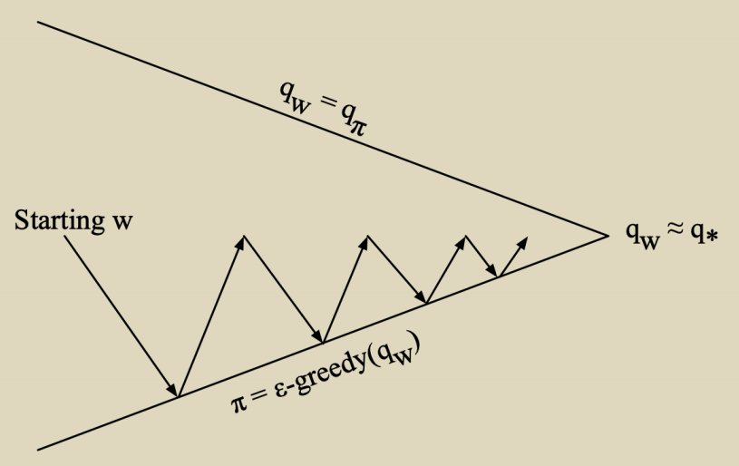
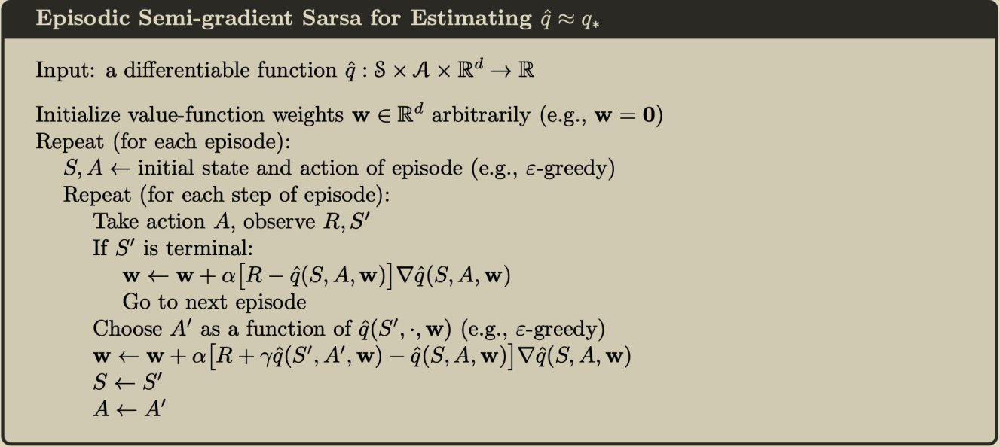

# yosoro~

## Value Function Approximation

价值函数近似：在状态空间或动作空间极大的实际问题中的应用方法

通常使用梯度下降的方法估计近似函数，有以下几种方法

### With an Oracle （w）

假定有来自外部的监管者给出的 oracle (w)
$$
v^\pi(s)\leftarrow\hat{v}(s, \mathbf{w}))^{2}
$$
上式近似方法下用均方误差定义 loss
$$
J(\mathbf{w})=\mathbb{E}_{\pi}\left[\left(v^{\pi}(s)-\hat{v}(s, \mathbf{w})\right)^{2}\right]
$$
使用梯度下降法最小化损失
$$
\begin{aligned}
\Delta \mathbf{w} &=-\frac{1}{2} \alpha \nabla_{\mathbf{w}} J(\mathbf{w}) \\
\mathbf{w}_{t+1} &=\mathbf{w}_{t}+\Delta \mathbf{w}
\end{aligned}
$$

1. 用特征向量描述状态

$$
\mathbf{x}(s)=\left(x_{1}(s), \ldots, x_{n}(s)\right)^{T}
$$

2. 用线性函数近似价值函数

$$
\hat{v}(s, \mathbf{w})=\mathbf{x}(s)^{T} \mathbf{w}=\sum_{j=1}^{\Pi^{\prime}} x_{j}(s) w_{j}
$$

此时目标损失函数为 w 向量的二次函数，容易得到其更新量
$$
\begin{aligned}
J(\mathbf{w})=\mathbb{E}_{\pi}\left[\left(v^{\pi}(s)-\mathbf{x}(s)^{T} \mathbf{w}\right)^{2}\right] \\
\Delta \mathbf{w}=\alpha\left(v^{\pi}(s)-\hat{v}(s, \mathbf{w})\right) \mathbf{x}(s)
\end{aligned}
$$
注意（Lookup Table）当采用独热编码表示状态时就退化到 Sarsa 了

### 增量 VFA 预测算法

在采样模拟过程中同时学习 value 的近似

- 假设存在真值的 value function 以给出时：
  $$
  \Delta \mathbf{w}=\alpha\left(v^{\pi}(s)-\hat{v}(s, \mathbf{w})\right) \nabla_{\mathbf{w}} \hat{v}\left(s_{t}, \mathbf{w}\right)
  $$

- 在 MC 采样中用 G_t 替换 target，是 v 的无偏估计
  $$
  \Delta \mathbf{w}=\alpha\left(G_{t}-\hat{v}\left(s_{t}, \mathbf{w}\right)\right) \nabla_{\mathbf{w}} \hat{v}\left(s_{t}, \mathbf{w}\right)
  $$

- 在 TD 过程中使用 TD target（有偏）
  $$
  \Delta \mathbf{w}=\alpha\left(R_{t+1}+\gamma \hat{v}\left(s_{t+1}, \mathbf{w}\right)-\hat{v}\left(s_{t}, \mathbf{w}\right)\right) \nabla_{\mathbf{w}} \hat{v}\left(s_{t}, \mathbf{w}\right)
  $$

## Action-Value Function Approximation

类似上方的估计（with an oracle），最小化 MSE 并采用随机梯度递减来寻找局部最优
$$
\hat{q}(s, a, \mathbf{w}) \approx q^{\pi}(s, a) \\
J(\mathbf{w})=\mathbb{E}_{\pi}\left[\left(q^{\pi}(s, a)-\hat{q}(s, a, \mathbf{w})\right)^{2}\right] \\
\Delta \mathbf{w}=\alpha\left(q^{\pi}(s, a)-\hat{q}(s, a, \mathbf{w})\right) \nabla_{\mathbf{w}} \hat{q}(s, a, \mathbf{w})
$$

1. 用特征向量描述状态和动作：
   $$
   \mathbf{x}(s, a)=\left(x_{1}(s, a), \ldots, x_{n}(s, a)\right)^{T}
   $$

2. 用特征的线性组合描述 action-value 函数
   $$
   \hat{q}(s, a, \mathbf{w})=\mathbf{x}(s, a)^{T} \mathbf{w}=\sum_{j=1}^{n} x_{j}(s, a) w_{j}
   $$

3. 梯度递减更新式：
   $$
   \Delta \mathbf{w}=\alpha\left(q^{\pi}(s, a)-\hat{q}(s, a, \mathbf{w})\right) \mathbf{x}(s, a)
   $$

对于没有 oracle —— 预先已知真值的问题，同上有

### 增量 Control 算法

- 对 MC 采样：
  $$
  \Delta \mathbf{w}=\alpha\left(G_{t}-\hat{q}\left(s_{t}, a_{t}, \mathbf{w}\right)\right) \nabla_{\mathbf{w}} \hat{q}\left(s_{t}, a_{t}, \mathbf{w}\right)
  $$

- 对 Sarsa 算法：
  $$
  \Delta \mathbf{w}=\alpha\left(R_{t+1}+\gamma \hat{q}\left(s_{t+1}, a_{t+1}, \mathbf{w}\right)-\hat{q}\left(s_{t}, a_{t}, \mathbf{w}\right)\right) \nabla_{\mathbf{w}} \hat{q}\left(s_{t}, a_{t}, \mathbf{w}\right)
  $$

- 对 Q-learning：
  $$
  \Delta \mathbf{w}=\alpha\left(R_{t+1}+\gamma \max _{a} \hat{q}\left(s_{t+1}, a, \mathbf{w}\right)-\hat{q}\left(s_{t}, a_{t}, \mathbf{w}\right)\right) \nabla_{\mathbf{w}} \hat{q}\left(s_{t}, a_{t}, \mathbf{w}\right)
  $$

收敛性问题，Batch 学习，最小二乘法（最小化平方误差和）暂略
