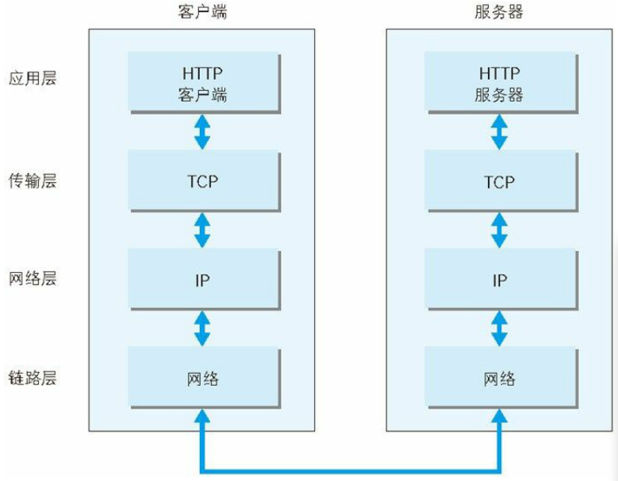
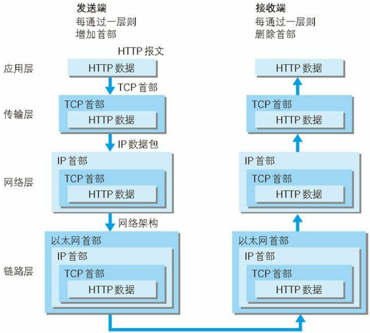

# 网络基础 TCP / IP

TCP / IP 是一个协议族，通常使用的网络是在其基础上运作的， HTTP 属于它内部的一个子集。

规则包括：如何探测到通信目标、由哪一边先发起通信、使用哪种语言进行通信、怎样结束通信等

## 分层管理

应用层、传输层、网络层、数据链路层

### 应用层

决定了向用户提供应用服务时通信的活动，HTTP 就属于该层

预存了应用服务如：

FTP（ File Transfer Protocol，文本传输协议）

DNS（ Domain Name System，域名系统）

### 传输层

提供处于网络连接中的两台计算机之间的数据传输

含两个性质不同的协议：

TCP（ Transmission Control Protocol，传输控制协议）

UDP（ User Data Protocol，用户数据包协议）

### 网络层（又名网络互连层）

用来处理在网络上流动的数据包 —— 是网络传输的最小数据单位。

规定了通过怎样的路径（传输路线）到达对方计算机，并把数据包传送给对方

### 链路层（又名数据链路层，网络接口层）

用来处理连接网络的硬件部分

包括控制操作系统、硬件的设备驱动、NIC（ Network Interface Card，网络适配器，即网卡），及光纤等物理可见部分（还包括连接器等一切传输媒介）

## 通信传输流

发送端在层与层之间传输数据时，每经过一层时必定会被打上一个该层所属的首部信息。而接收端在层与层传输数据时，每经过一层时会把对应的首部消去。

这种把数据信息包装起来的做法称为封装（encapsulate）。

