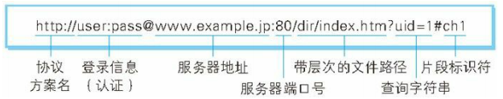

# 资源

URI（ Uniform Resource Identifier，统一资源标识符）

URL（ Uniform resource Locator，统一资源定位符）

## URI 格式

1. 协议方案名，指定协议类型。不区分大小写，最后附一个冒号（：）也可以使用 data: 或 javascript: 这类指定数据或脚本程序的方案名
2. 登录信息。可选项
3. 服务器地址。可以是 DNS 可解析的名称，或是 192.168.1.1 这类 IPv4 或者 [0:0:0:0:0:0:0:1] 这类 IPv6 地址名
4. 服务器端口号。可选项
5. 带层次的文件路径，指定服务器上的文件路径来定位特指的资源。与 UNIX 系统的文件目录结构相似
6. 查询字符串，传入参数用。可选
7. 片段标识符，标记出以获取资源中的子资源。可选