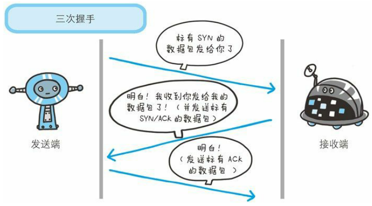

# HTTP

客户端 client 通过 Web 浏览器指定的 URL 向服务器端请求资源 resource 等信息

而 HTTP ( HyperText Transfer Protocol ) 即为上述流程中的规范协议

## 关联协议：IP、TCP、DNS

### 一、负责传输的 IP 协议

位于网络层，把各种数据包传送给对方。

两个重要条件：IP 地址和 MAC 地址（ Media Access Control Address）

IP 地址指明了节点被分配到的地址，MAC 地址是指网卡所属的固定地址。IP 地址可以和 MAC 地址进行配对。IP 地址可变换，但 MAC 地址基本还是那个不会更改。

#### 使用 ARP 协议凭借 MAC 地址进行通信

IP 间的通信依赖 MAC 地址。不同局域网内通信需要经过多台计算机和网络设备中转，利用 MAC 地址来搜索，采用 ARP 协议（ Address Resolution Protocol）

ARP 是一种用以解析地址的协议，根据通信方的 IP 地址就可以反查出对应的 MAC 地址。

路由选择（ routing）：传输过程中只有大概方向，往下一个 MAC 地址传，并不会一开始就明确哪条路径能到

### 二、确保可靠性的 TCP 协议

位于传输层，提供可靠的字节流服务。

所谓字节流服务（ Byte Stream Service） 指，为了方便传输，将大块数据分割成以报文（ segment）为单位的数据包进行管理

#### 确保数据能到达目标

采用三次握手（ three-way handshaking）策略

握手过程中使用了 TCP 的标志（ flag）—— SYN（ synchronized）和 ACK（ acknowledgement）

发送端首先发送一个带 SYN 标志的数据包给对方。接收端收到后，回传一个带有 SYN/ACK 标志的数据包以表示传达确认信息。最后，发送端再回传一个带 ACK 标志的数据包，代表“握手”结束

若在捂手过程中某个阶段莫名中断，TCP 协议会再次以相同的顺序发送相同的数据包

### 三、负责域名解析的 DNS 服务

位于应用层，提供域名到 IP 地址之间的解析服务

计算机既可以被赋予 IP 地址们也可以被赋予**主机名和域名**（通常访问用这个）

前者易于计算机解析，后者易于用户记忆

### 四、关系

## 简要介绍

用于客户端和服务器之间的通信

### 规定

- 请求从客户端发出，最后服务器端响应该请求并返回。服务器端在没有接收到请求之前不会发送响应
- 不保存状态 —— 但为了保存登录状态，引入了 Cookie
- 持久连接：只要任意一端没有明确提出断开连接，则保持 TCP 连接状态
- 管线化（ pipelining）：不用等待响应即可直接发送下一个请求

### 请求报文

### 响应报文

### 可用方法

#### GET ：获取资源

若请求的资源是文本，那就保持原样返回；

若是像 CGI（ Common Gateway Interface，通用网关借口），则返回经过执行后的输出结果

#### POST ：传输实体主体

通常由客户端向服务器传输数据，服务器返回处理数据后的结果

#### PUT：传输文件

要求在请求报文的主体中包含文件内容，然后保存到请求 URI 指定的位置 —— 该方法本身不带验证机制，由于安全性问题，一般的 Web 网站不使用

#### HEAD：获得报文首部

和 GET 方法形式一样，只是不返回报文主体部分。用于确认 URI 的有效性及资源更新的日期时间等

#### DELETE：删除文件

与 PUT 相反，按请求 URI 删除指定的资源 —— 同样不带验证机制，一般不支持

#### OPTIONS：询问支持的方法

用来查询针对请求 URI 指定的资源支持的方法

#### TRACE：追踪路径

让 Web 服务器端将之前的请求通信环回给客户端的方法

#### CONNECT：要求用隧道协议连接代理

要求在与代理服务器通信时建立隧道，实现用隧道协议进行 TCP 通信。主要使用 SSL（ Secure Socket Layer，安全套接层）和 TSL（ Transport Layer Security，传输层安全）协议把通信内容加密后经网络隧道传输

### 使用 Cookie 的状态管理

## 报文的信息

HTTP 报文本身是由多行（用 CR + LF 作换行符）数据构成的字符串文本

### 请求报文和响应报文

- 请求行：包含用于请求的方法，请求 URI 和 HTTP 版本

- 状态行：包含表明响应结果的状态码，原因短语和 HTTP 版本
- 首部字段：包含表示请求和响应的各种条件和属性的各类首部。一般有四种首部，分别是：通用首部、请求首部、响应首部和实体首部
- 其他：可能包含 HTTP 的 RFC 里未定义的首部（ Cookie 等）

### 范围请求（ Range Request）

指定下载的实体范围，用于实现从之前下载中断处恢复下载

用首部字段 Range 来指定资源的 byte 范围

针对范围请求，响应会返回状态码为 206 Partial Content 的响应报文。

如果服务器端无法响应范围请求，则会返回状态码 200 OK 和完整的实体内容。

### 内容协商（ Content Negotiation）

当浏览器的默认语言为英文或中文，访问相同的 URI 的 Web 页面时，则会显示对应的英文版或中文版的 Web 页面。

基于如下首部字段判断：

- Accept、Accept-Charset、Accept-Encoding、Accept-Language、Content-Language

内容协商技术有以下 3 种类型：

- 服务器驱动协商（ Server-driven Negotiation）
  - 由服务器端进行内容协商。以请求的首部字段为参考，在服务器端自动处理。
- 客户端驱动协商（ Agent-driven Negotiation）
  - 由客户端进行内容协商。用户从浏览器显示的可选列表中手动选择。或利用 JS 脚本在 Web 页面上自动选择
- 透明协商（ Transparent Negotiation）
  - 是服务器驱动和客户端驱动的结合体，是由服务器端和客户端各自进行内容协商的一种方法

## 状态码

告知从服务器端返回的请求结果

### 2XX 成功

表明请求被正常处理了

#### 200 OK

表示从客户端发来的请求在服务器端被正常处理了

#### 204 No Content

表示服务器接收的请求已成功处理，但在返回的响应报文中不含实体的主体部分，也不允许返回任何实体的主体

#### 206 Partial Content

表示客户端进行了范围请求，而服务器成功执行了这部分的 GET 请求。响应报文中包含由 Content-Range 指定范围的实体内容

### 3XX 重定向

表明浏览器需要执行某些特殊的处理以正确处理请求

#### 301 Moved Permanently

永久性重定向。表示请求的资源已被分配了新的 URI，以后应使用资源现在所指的 URI

#### 302 Found

临时性重定向。表示请求的资源已被分配了新的 URI，希望用户（本次）能使用新的 URI 访问

#### 303 See Other

表示由于请求对应的资源存在着另一个 URI，应使用 GET 方法定向获取请求的资源

#### 304 Not Modified

表示客户端发送附带条件的请求时，服务器端允许请求访问资源，但未满足条件的情况。其返回不包含任何响应主体

#### 307 Temporary Redirect

临时重定向。

### 4XX 客户端错误

表明客户端是发生错误的原因所在

#### 400 Bad Request

表示请求报文中存在语法错误。当错误发生时，需修改请求的内容后再次发送请求

#### 401 Unauthorized

表示发送的请求需要有通过 HTTP 认证（ BASIC 认证、DIGEST 认证）的认证信息。若之前已进行过一次请求，则表示用户认证失败

返回含有 401 的响应必须包含一个适用于被请求资源的 WWW-Authenticate 首部用以质询（ challenge）用户信息。当浏览器初次接收到 401 响应，会弹出认证用的对话窗口

#### 403 Forbidden

表明对请求资源的访问被服务器拒绝了。如未获得文件系统的访问授权，访问权限出现某些问题等

#### 404 Not Found

表明服务器上无法找到请求的资源。也可在服务器端拒绝请求且不想说明理由时使用

### 5XX 服务器错误

表明服务器本身发生错误

#### 500 Internal Server Error

表明服务器端在执行请求时发生了错误。也有可能是 Web 应用存在的 bug 或某些临时的故障

#### 503 Service Unavailable

表明服务器暂时处于超负载或正在进行停机维护，现在无法处理请求。若预知时间最好写入 RetryAfter 首部字段再返回给客户端

## Web 服务器

一台 Web 服务器可搭建多个独立域名的 Web 网站，也可作为通信路径上的中转服务器提升传输效率

### 代理

是一种有转发功能的应用程序，扮演了位于服务器和客户端“中间人”的角色，接收由客户端发送的请求并转发给服务器，同时也接收服务器返回的响应并转发给客户端

#### 优势

利用缓存技术减少网络带宽的流量，组织内部针对特定网站的访问控制，以获取访问日志为主要目的，等等

#### 分类

是否使用缓存（ Caching Proxy，缓存代理），是否会修改报文（ Transparent Proxy，透明代理）

### 网关

是转发其他服务其通信数据的服务器，接收从客户端发送来的请求时，就像自己拥有资源的源服务器一样对请求进行处理

如连接数据库

### 隧道

是在相隔甚远的客户端和服务器两者之间进行中转，并保持双方通信连接的应用程序

隧道本身不会去解析 HTTP 请求

## HTTP 首部

