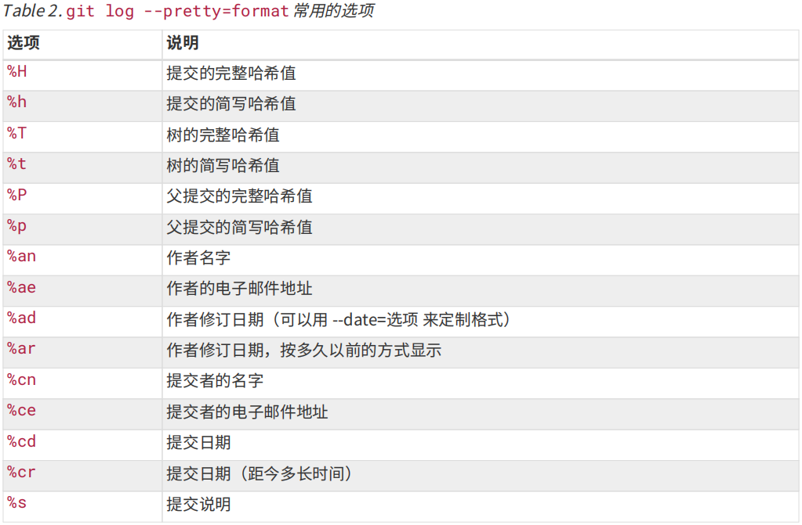
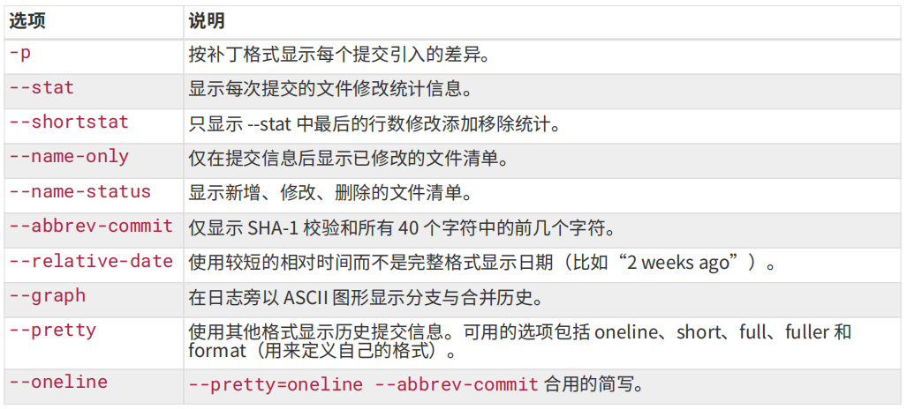
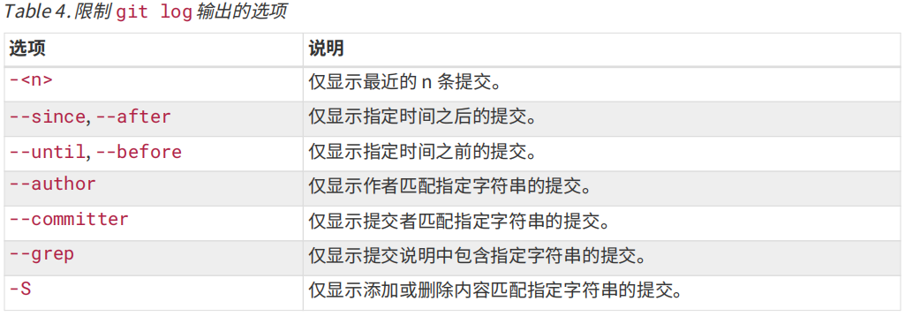

# Git 工作流

## 获取 Git 仓库

1. 将尚未进行版本控制的本地目录转换为 Git 仓库
2. 从其他服务器**克隆**一个已存在的 Git 仓库

### 初始化仓库

1. 命令行进入要初始化的目录
2. `git init` 创建一个`.git` 子目录用于 Git 工作
3. `git add .` 添加需要管理的目录下文件
4. `git commit -m "first commit"` 完成第一次提交得到仓库和分支

### 克隆仓库

一般用 http 协议克隆

```shell
$ git clone https://github.com/libgit2/libgit2 [user_define_name]
```

## 文件控制

```shell
$ git status # 查看文件修改状态
$ git add [glob 匹配文件] # 暂存文件
$ git commit # 提交暂存内容
$ git diff # 查看未暂存的文件更新
$ git diff --staged / --cached # 查看已暂存的文件更新
```

```shell
$ git rm [glob] # 取消 Git 跟踪该文件并删除文件
$ git rm --cached [glob] # 取消暂存和跟踪但保留文件，一般用于处理编译生成文件
```

### 撤销修改

```shell
$ git reset HEAD <file>... # 取消暂存
$ git checkout -- <file> # 撤销对文件所做的修改，应该是基于前一次提交
```

### 日志输出

```shell
$ git log [-p] [-n] [--stat] [--pretty=oneline] # 查看提交日志，后带选项查看差异信息，最近 n 次，修改信息，pretty 可指定 oneline, short, full, fuller 来改变显示格式
$ git log --pretty=format:"%h - %an, %ar : %s" # 格式化日至输出，常配合 --graph
```





#### 限制 git log 输出的选项



### 忽略文件

`.gitignore` 文件中列出要忽略的文件的模式，格式规范：

- 所有空行或以 `#` 开头的行会被 Git 忽略
- 可以使用标准的 glob 模式匹配，会递归地应用在整个工作区中
- 匹配模式可以以 `/` 开头防止递归
- 匹配模式可以以 `/` 结尾指定目录
- 要忽略指定模式以外的文件或目录，可以在模式前加上 `!`

其中 glob 模式是指 shell 所使用的简化了的正则表达式：

- 星号 `*` 匹配 0 个或多个任意字符； 

- `[abc]` 匹配任何**一个**方括号内的字符； 

- 问号 `?` 匹配一个任意字符；
- 如 `[0-9]` 匹配任意一个数字；
- 使用两个星号 `**` 表示匹配任意中间目录，比如 `a/**/z` 可以匹配 `a/z` 或 `a/b/c/z`

[针对性 gitignore 文件](https://github.com/github/gitignore)

## 远程仓库

```shell
$ git remote [-v] # 列出指定的每一个远程服务器的简写，选项显示 URL
$ git remote add <shortname> <url> # 添加一个新的远程 Git 仓库，并指定一个简称，通过 sn/branch 访问不同远程仓库下的分支
$ git fetch <remote> # 将远程仓库中自己没有的数据下载下来，需要再手动合并
$ git pull <remote> # 直接拉取并合并远程仓库已跟踪的分支

$ git push <remote> <branch> # 向远程仓库推送本地分支，若远程已存在会提交更新
$ git remote show <remote> # 查看一个远程仓库的更多信息

$ git remote rename <remote> <new_name> # 重命名
$ git remote remove / rm <remote> # 移除连接
```

