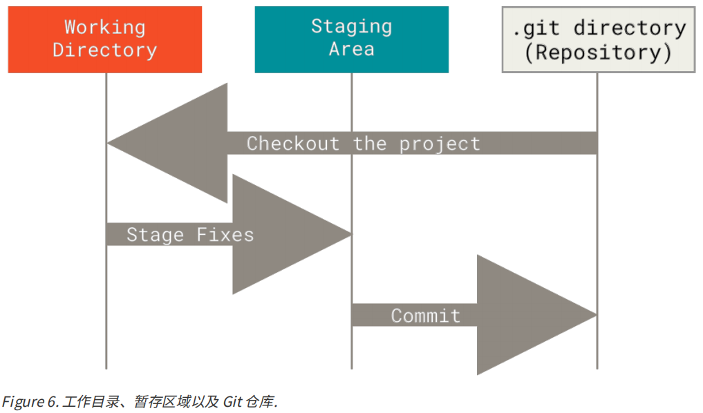

# Git 简介

- Git 是把数据看作对小型文件系统的一系列快照 (snapshut)，构成一个快照流

- 几乎所有操作都在本地执行，确保了版本控制的效率
- 几乎处处在使用哈希，一般只添加而不删除数据
- 文件仅有三种状态：**已提交（committed）、已修改（modified）、已暂存（staged）**
  - 已修改表示修改了文件，但还没保存到数据库中（编辑器中已保存）
  - 已暂存表示对一个已修改文件的当前版本做了标记，使之包含在下次提交的快照中
  - 已提交表示数据已经安全地保存在本地数据库中



基本的 Git 工作流程如下：

1. 在工作区中修改文件
2. 将想要下次提交的更改选择性地暂存
3. 提交更新，将快照永久性存储到 Git 目录


## 配置文件

Git 自带一个 `git config` 工具来帮助设置控制 Git 外观和行为地配置变量

1. `/etc/gitconfig` 文件：包含系统上每一个用户及他们仓库的通用配置。如果在执行 `git config` 时带上 `--system` 选项，那么它就会读写该文件中的配置变量。（由于它时系统配置文件，因此需要 su 权限）
2. `~/.gitconfig` 或 `~/.config/git/config` 文件：只针对当前用户。可以传递 `--global` 选项让 Git 读写此文件，这会对该用户下**所有**的仓库生效
3. `.git/config` 文件：针对该仓库。可以传递 `--local` 选项让 Git 强制读写此文件，虽然默认情况下就是它（需要先进入某个 Git 仓库）

每个级别会覆盖上一级别的配置

### 查看所有配置

```shell
$ git config --list --show-origin
```

### 常用配置

#### 用户信息

```shell
$ git config --global user.name "mikyi"
$ git config --global user.email email_address@163.com
```

#### 文本编辑器

```shell
$ git config --global core.editor __ # 需要指定可执行文件路径（Windows上）
```

